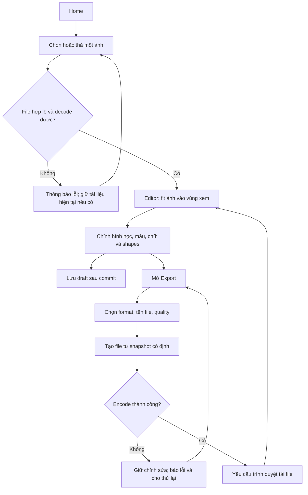
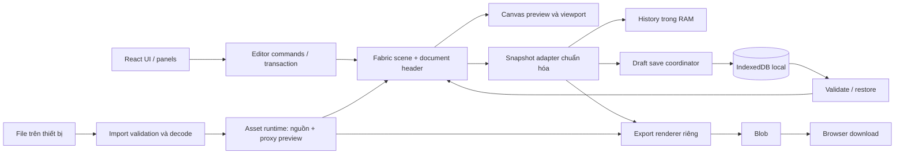

# MiniPhoto Editor — Phân tích ý tưởng và PRD

**Phiên bản:** 1.0 · **Ngày:** 07/10/2026 · **Trạng thái:** Đặc tả đề xuất, đã cập nhật các quyết định người dùng xác nhận.

Tài liệu này gồm phân tích ý tưởng, phạm vi sản phẩm, yêu cầu chức năng, màn hình, luồng, kiến trúc, dữ liệu, kiểm thử và kế hoạch triển khai. Các con số về hiệu năng, giới hạn và thời gian là mục tiêu/ước lượng đề xuất, chưa phải kết quả đo hoặc cam kết đã được kiểm chứng.

**Định hướng:** Một website chỉnh ảnh nhanh trên trình duyệt: chọn ảnh → chỉnh sửa → tải kết quả. Desktop là trải nghiệm chính; mobile sử dụng website responsive. Ảnh được xử lý tại thiết bị. MVP không yêu cầu tài khoản, backend hoặc database server; có IndexedDB để lưu một bản nháp tại trình duyệt.

## Mục lục

1. [Quyết định và giả định](#1-quyết-định-và-giả-định)
2. [Đối chiếu toàn bộ ý tưởng gốc](#2-đối-chiếu-toàn-bộ-ý-tưởng-gốc)
3. [Phân tích và các điểm cần sửa trong concept](#3-phân-tích-và-các-điểm-cần-sửa-trong-concept)
4. [Tầm nhìn, đối tượng và tình huống sử dụng](#4-tầm-nhìn-đối-tượng-và-tình-huống-sử-dụng)
5. [Mục tiêu và cách xác nhận giá trị](#5-mục-tiêu-và-cách-xác-nhận-giá-trị)
6. [Phạm vi phiên bản](#6-phạm-vi-phiên-bản)
7. [Thuật ngữ và quy tắc chung](#7-thuật-ngữ-và-quy-tắc-chung)
8. [Luồng sử dụng](#8-luồng-sử-dụng)
9. [Danh sách màn hình](#9-danh-sách-màn-hình)
10. [Thiết kế giao diện](#10-thiết-kế-giao-diện)
11–25. Đặc tả từng công cụ, bản nháp, trạng thái và lỗi.
26–33. Hiệu năng, công nghệ, kiến trúc, cấu trúc thư mục, dữ liệu, API nội bộ và bảo mật.
34–38. Nghiệm thu, roadmap, backlog, chi phí và vận hành.
39–43. Mở rộng, quyết định còn mở, FAQ, hướng dẫn giao việc và nguồn kỹ thuật.

## 1. Quyết định và giả định

| ID | Nội dung | Trạng thái |
|---|---|---|
| D01 | Website desktop, giao diện responsive trên mobile; theo yêu cầu bổ sung ngày 09/10/2026, có thêm wrapper Android Capacitor để cài APK debug thủ công. iOS native và phát hành Play Store ngoài phạm vi | Người dùng xác nhận; Android là quyết định bổ sung |
| D02 | MVP chỉ có Brightness, Contrast, Saturation | Người dùng xác nhận |
| D03 | Exposure, Temperature, Blur, Sharpness thuộc phiên bản sau | Người dùng xác nhận |
| D04 | Tự lưu 1 bản nháp cục bộ để khôi phục sau reload | Người dùng xác nhận |
| D05 | Import/export JPG, PNG, WebP; crop, resize, rotate/flip, filters, text, shapes, layers, undo/redo, compare | Kế thừa ý tưởng gốc |
| D06 | Xử lý ảnh tại trình duyệt; không đăng nhập, không AI trong MVP | Kế thừa ý tưởng gốc |
| D07 | React + TypeScript + Vite + Fabric.js; CSS Modules cho giao diện | Đề xuất kỹ thuật |
| D08 | Một ảnh nền và tối đa 50 đối tượng text/shape; một tài liệu đang mở | Đề xuất giới hạn MVP |
| D09 | Giao diện tiếng Việt; tên tạm MiniPhoto Editor; home sáng, editor tối trung tính | Giả định thiết kế, có thể đổi |
| D10 | Mobile có cùng nhóm chức năng qua bottom sheet, không chỉ thu nhỏ giao diện desktop | Diễn giải đề xuất cho yêu cầu responsive |
| D11 | Chưa bật analytics bên ngoài, quảng cáo hoặc tracking trong MVP | Đề xuất để giữ riêng tư và giảm phạm vi |
| D12 | Mục đích học/nộp bài hay ra mắt thật; đội ngũ, thời hạn, kỹ năng hiện tại | Chưa có câu trả lời; roadmap dùng giả định ở mục 35 |

Phạm vi đã đủ để đặc tả và bắt đầu thử nghiệm kỹ thuật. Trước khi triển khai toàn bộ, cần xác nhận các giả định D07–D11 và lịch làm việc D12; không coi chúng là quyết định người dùng đã duyệt.

## 2. Đối chiếu toàn bộ ý tưởng gốc

Giữ nguyên thứ tự 19 mục của tài liệu đầu vào để không bỏ sót phần nào.

| Mục gốc | Nội dung | Cách đưa vào PRD |
|---|---|---|
| 1 | Ý tưởng cốt lõi | Tầm nhìn và đối tượng ở mục 4 |
| 2 | Bộ chức năng MVP | Phạm vi mục 6; yêu cầu mục 11–24 |
| 3 | Giao diện ba khu vực | Desktop ở mục 10; mobile có bố cục riêng |
| 4 | Luồng sử dụng chính | Mục 8, có cả khôi phục và lỗi |
| 5 | Trang đầu tiên | Home và vùng chọn/kéo thả ảnh |
| 6 | Crop | Sáu tỷ lệ; quy tắc cắt cả tài liệu, không làm mất nguồn |
| 7 | Adjust | Giảm từ 7 xuống 3 điều chỉnh theo câu trả lời mới |
| 8 | Filter | 10 lựa chọn tính cả Original; công thức phiên bản hóa |
| 9 | Text tool | Font, size, color, bold, italic, alignment, opacity, di chuyển |
| 10 | Layers đơn giản | Chọn, ẩn/hiện, xóa, đổi thứ tự; giới hạn ảnh nền |
| 11 | Undo/redo | Đưa vào nền tảng từ đầu; tối đa 50 bước |
| 12 | Export | Format, chất lượng, kích thước, alpha, tên file và lỗi |
| 13 | Before/after | Định nghĩa chính xác nội dung so sánh |
| 14 | Local-first | Không gửi ảnh lên server; giới hạn offline và lưu cục bộ |
| 15 | Công nghệ | So sánh Fabric/Konva/native, chọn một engine |
| 16 | Cấu trúc project | Tổ chức theo feature editor; không tạo folder rỗng cho tương lai |
| 17 | Phân chia phiên bản | Sắp lại để history, responsive và export được kiểm tra sớm |
| 18 | Chưa đưa AI vào | Ngoài MVP; có điều kiện mở rộng ở mục 39 |
| 19 | Product Brief | Chuyển thành mục tiêu, yêu cầu, nghiệm thu và backlog |

## 3. Phân tích và các điểm cần sửa trong concept

### 3.1. Điểm mạnh

- Nhu cầu rõ: chỉnh nhanh một ảnh, không cần học một bộ công cụ lớn.
- Luồng ngắn, không có rào cản đăng ký.
- Xử lý tại trình duyệt phù hợp với crop, màu, text và shapes; giảm việc xây backend cho nhu cầu chưa có.
- Text/shapes giúp sản phẩm hữu ích hơn một trang chỉ đổi kích thước ảnh.
- Bản nháp cục bộ giải quyết tình huống reload ngoài ý muốn mà không cần tài khoản.

Đây là giả thuyết sản phẩm hợp lý, chưa phải bằng chứng có thị trường hoặc người dùng sẽ trả tiền. Cần pilot ở mục 5.

### 3.2. Những phần đã có nhưng còn quá sơ lược để code

| Phần | Vấn đề chưa rõ trong ý tưởng | Quy tắc đề xuất |
|---|---|---|
| Crop | Cắt ảnh nền hay toàn bộ nội dung? | Cắt khung tài liệu, áp dụng cho toàn bộ composition |
| Resize | Chỉ đổi ảnh nền hay cả chữ/hình? | Scale đồng đều cả tài liệu và đối tượng; giữ tỷ lệ |
| Rotate/flip | Có xoay/lật text và shapes? | Có, toàn bộ tài liệu; flip có thể làm chữ bị phản chiếu |
| Filter + adjust | Chọn filter có xóa slider hay chồng hiệu ứng? | Preset riêng, slider riêng; preset trước, slider sau |
| Original | Có reset crop và xóa chữ không? | Chỉ tắt preset; giữ slider và nội dung khác |
| Compare | Ảnh nhập đầu tiên hay ảnh trước chỉnh màu? | Cùng hình học hiện tại, bỏ màu/filter và ẩn overlay |
| Layers | Ai được xóa/đổi thứ tự ảnh nền? | Ảnh nền cố định dưới cùng; chỉ overlay được xóa/đổi thứ tự |
| Export | Preview nhỏ có trở thành file nhỏ? | Export theo pixel tài liệu, độc lập zoom/DPR |
| History | Lưu ảnh bitmap mỗi thao tác? | Snapshot JSON nhỏ, dùng chung nguồn ảnh |
| Move image | Di chuyển nội dung hay di chuyển góc nhìn? | Ảnh nền khóa; pan thay đổi góc nhìn |

### 3.3. Những mục còn thiếu trong ý tưởng

Giới hạn ảnh; EXIF orientation; ảnh trong suốt; định dạng không hỗ trợ; dữ liệu giả đuôi file; nhiều ảnh được thả cùng lúc; keyboard/IME tiếng Việt; font chưa tải; lỗi WebGL; giới hạn bộ nhớ; browser không encode WebP; mất bản nháp; lưu nhiều tab; accessibility; quyền riêng tư; cấu hình deploy; tiêu chí nghiệm thu và cách đo hiệu năng.

PRD này bổ sung các mục đó. Không thêm tài khoản, cloud, thanh toán hay AI chỉ để tài liệu trông lớn hơn.

### 3.4. Độ phức tạp thực tế

Import và vài slider tương đối dễ. Phần khó nằm ở tương tác giữa crop/resize/rotate/layers/history, giữ độ nét khi export, font tiếng Việt và bộ nhớ mobile. Vì vậy phải thử một luồng đầu cuối trước khi xây nhiều panel đẹp.

## 4. Tầm nhìn, đối tượng và tình huống sử dụng

**Tuyên bố sản phẩm:** MiniPhoto Editor giúp người dùng chọn một ảnh, chỉnh kích thước và màu, thêm chú thích đơn giản rồi tải kết quả trong vài phút, trực tiếp trên trình duyệt, không cần tài khoản.

| Nhóm ưu tiên | Công việc cần làm | Ví dụ |
|---|---|---|
| Người dùng phổ thông | Crop, làm sáng, tải ảnh | Cắt ảnh chân dung 1:1 |
| Sinh viên/người làm nội dung nhỏ | Thêm chữ, hình đánh dấu | Thumbnail bài trình bày |
| Người bán hàng cá nhân | Resize và thêm nhãn | Ảnh sản phẩm với chữ giá/khuyến mãi |

Không nhắm đến chỉnh RAW, retouch chuyên nghiệp, in ấn quản lý màu, thiết kế hàng trăm layer hoặc dựng bộ nhận diện phức tạp.

**Các jobs-to-be-done ưu tiên:**

1. Tôi có một ảnh và muốn đổi tỷ lệ/kích thước mà không cài phần mềm.
2. Tôi muốn ảnh sáng hoặc màu dễ nhìn hơn bằng vài điều khiển dễ hiểu.
3. Tôi muốn thêm một dòng chữ/hình đánh dấu và tải ảnh đúng kích thước.
4. Tôi muốn sửa sai bằng undo và có thể tiếp tục khi lỡ reload.

Lợi thế đề xuất là sự gọn, dễ dùng và ảnh ở thiết bị. Không tuyên bố độc quyền công nghệ hoặc vượt trội mọi editor khác.

## 5. Mục tiêu và cách xác nhận giá trị

**Mục tiêu sản phẩm đề xuất:** hoàn thành một tác vụ chỉnh ảnh thông dụng mà không cần hướng dẫn trực tiếp; cảm thấy an toàn khi thử thao tác; kết quả tải xuống khớp tài liệu đang chỉnh.

Pilot nhỏ: 8–12 người thuộc ba nhóm mục 4, có cả người dùng desktop và mobile. Đây là quy mô nghiên cứu UX đề xuất, không đủ chứng minh thị trường.

| Tác vụ pilot | Tiêu chí mục tiêu |
|---|---|
| Nhập ảnh → crop 1:1 → tăng sáng → tải JPG | Ít nhất 80% hoàn thành không cần trợ giúp |
| Thêm chữ tiếng Việt → thêm shape → đổi thứ tự → tải PNG | Ít nhất 80% hoàn thành không cần trợ giúp |
| Undo lỗi → reload → khôi phục bản nháp | Không mất trạng thái đã báo lưu thành công |
| Tìm định dạng và kích thước export | Người dùng hiểu trước khi tải |

Thời gian tác vụ đầu mục tiêu dưới 3 phút cho người mới, chưa tính chọn ảnh ngoài website. Ghi nhận bằng quan sát trực tiếp trong pilot, không cần cài tracking để kiểm tra giả thuyết.

Không dùng thời gian ở lại trang làm thước đo chính: một công cụ nhanh có thể giúp người dùng rời trang sớm vì đã xong việc.

## 6. Phạm vi phiên bản

**P0 = phải có trước khi gọi MVP hoàn chỉnh. P1 = phiên bản sau MVP.**

| Nhóm | P0 | P1 / ngoài MVP |
|---|---|---|
| Nhập ảnh | Chọn file, drag/drop; JPG/PNG/WebP tĩnh; một ảnh | Nhiều ảnh, clipboard, URL, HEIC/RAW/GIF/SVG |
| Hình học | Crop tự do/6 tỷ lệ, resize giữ tỷ lệ, xoay ±90°, flip H/V | Xoay góc bất kỳ, perspective, đổi canvas bằng padding |
| Màu | Brightness, Contrast, Saturation | Exposure, Temperature, Blur, Sharpness |
| Filter | Original + 9 preset | LUT, filter tùy chỉnh, intensity slider |
| Text | Nhiều textbox, một style mỗi textbox, kéo/scale/rotate | Rich text, curved text, shadow/effects |
| Shape | Rectangle, circle, line; fill/stroke/opacity | Vẽ tay, sticker, polygon, gradients |
| Layers | Chọn, ẩn/hiện, xóa, lên/xuống | Group, mask, nhiều ảnh nền, blend modes |
| History | Undo/redo tối đa 50 bước | Lịch sử vĩnh viễn, timeline |
| Export | PNG/JPG/WebP, chất lượng lossy, tên file, JPG background | ZIP/batch, SVG/PDF, target KB chính xác |
| An toàn UX | Compare, cảnh báo thay ảnh/reset, 1 draft cục bộ | Thư viện dự án, file project portable |
| Thiết bị | Desktop ưu tiên; web responsive có thao tác touch cơ bản; Android WebView wrapper dùng lại cùng app | iOS native và UX cử chỉ native nâng cao |
| Hệ thống | Frontend static, HTTPS, không đăng nhập | Cloud sync, backend, thanh toán, AI |

MVP có 7 nhóm công cụ chính: **Crop · Adjust · Filters · Resize · Text · Shapes · Export**. Rotate/flip nằm trong Crop/Transform; Layers là tab panel; Undo/redo và Compare nằm ở topbar. Không bỏ công cụ chỉ vì không có một nút sidebar riêng.

## 7. Thuật ngữ và quy tắc chung

- **Nguồn ảnh:** file người dùng chọn; giữ bất biến trong phiên và khi lưu draft.
- **Tài liệu:** kích thước đầu ra theo pixel, ảnh nền và các overlay.
- **Composition:** toàn bộ ảnh nền + text + shapes theo thứ tự hiển thị.
- **Overlay:** textbox hoặc shape nằm trên ảnh nền.
- **Viewport:** zoom/pan để xem; không thay đổi tài liệu hoặc file xuất.
- **Snapshot:** trạng thái tài liệu có thể phục hồi; không chứa bản sao bitmap.
- **Draft:** nguồn ảnh + snapshot mới nhất, lưu tại origin/trình duyệt đang dùng.
- **Commit:** hoàn tất một hành động người dùng, tạo tối đa một bước history.
- **Pixel:** đơn vị kích thước tài liệu. DPI không phải thước đo kích thước ảnh màn hình.

Một tài liệu luôn có đúng một ảnh nền. Không có màn hình tạo canvas trắng trong MVP. Bắt đầu ảnh khác là thay tài liệu, không thêm ảnh thứ hai vào layer.

Điều chỉnh màu và filter chỉ tác động ảnh nền. Crop/resize/rotate/flip tác động toàn composition. Chữ và shapes giữ màu riêng khi thay slider.

**Local-first không đồng nghĩa offline hoàn toàn:** Sau khi website, font và engine đã tải, các thao tác local có thể tiếp tục khi mạng mất. MVP không đảm bảo mở lại website/reload khi offline; chưa làm service worker/PWA. Draft chỉ khôi phục khi ứng dụng có thể mở.

## 8. Luồng sử dụng

### 8.1. Luồng chính



Không có màn hình Preview riêng bắt buộc: canvas là preview chính; modal export có bản xem trước nhỏ và thông tin file.

### 8.2. Khôi phục draft

Mở website → đọc draft → nếu hợp lệ, hiện thumbnail, kích thước và thời điểm lưu → chọn **Tiếp tục chỉnh** hoặc **Bỏ bản nháp**. Không tự mở ảnh riêng tư ngay trên Home. Nếu chưa chọn, draft vẫn được giữ.

Mở trực tiếp `/editor` khi chưa có tài liệu → kiểm tra draft → hiện lựa chọn khôi phục; nếu không có draft, trở về Home với CTA chọn ảnh.

### 8.3. Thay ảnh

Chọn ảnh mới → kiểm tra/decode ứng viên → nếu đang có tài liệu, hỏi thay thế → đồng ý thì tạo tài liệu mới, reset history và thay draft bằng transaction. Hủy hoặc import lỗi giữ nguyên tài liệu/bản nháp cũ. Thông báo rõ chỉ có một bản nháp.

### 8.4. Ví dụ cụ thể

1. Nhập ảnh 4000 × 3000.
2. Crop 1:1 thành 3000 × 3000.
3. Resize chiều rộng 1080 → chiều cao tự thành 1080.
4. Brightness +10, Saturation +5.
5. Thêm textbox “Mùa hè của tôi”, kéo xuống dưới.
6. Compare để xem ảnh nền trước chỉnh màu, cùng khung crop hiện tại.
7. Export JPG chất lượng 90, nền trắng → file đúng 1080 × 1080.

## 9. Danh sách màn hình

| ID | Màn hình / bề mặt | Nội dung và hành động |
|---|---|---|
| S01 | Home `/` | Giá trị sản phẩm, chọn/kéo thả ảnh, định dạng/giới hạn, resume draft |
| S02 | Editor `/editor` | Topbar, công cụ, canvas, properties/layers, zoom và trạng thái lưu |
| S03 | Export dialog | Format, quality, filename, kích thước readonly, JPG background, download |
| S04 | Resume draft dialog/card | Thumbnail, ngày giờ, tiếp tục, bỏ nháp, lỗi khôi phục |
| S05 | Confirm dialog | Thay ảnh, reset tất cả, bỏ bản nháp; mô tả hậu quả cụ thể |
| S06 | Help dialog | Phím tắt, giới hạn, lưu cục bộ, compare, định dạng |
| S07 | Privacy `/privacy` | Dữ liệu nào ở thiết bị, dữ liệu nào host có thể nhận, cách xóa draft |

Panel công cụ là trạng thái của Editor, không phải các route riêng. Mobile dùng bottom sheet tương ứng S02. Không cần dashboard, hồ sơ, login hay admin.

## 10. Thiết kế giao diện

### 10.1. Phong cách đề xuất

Home sáng để đọc dễ; editor dùng xám tối trung tính để vùng ảnh nổi bật. Một màu nhấn xanh lam, tránh làm panel màu sặc sỡ ảnh hưởng đánh giá màu ảnh. Đây là đề xuất, chưa phải yêu cầu người dùng xác nhận.

Token ban đầu: home background `#F8FAFC`; editor background `#111827`; panel `#1F2937`; chữ editor `#F9FAFB`; chữ phụ `#CBD5E1`; accent `#2563EB`; border `#475569`. Kiểm tra contrast thực tế trước release; màu token tự nó không chứng minh đạt accessibility.

Spacing 4/8/12/16/24 px; font UI 14–16 px; control touch ít nhất 44 × 44 CSS px; bo góc 8–12 px. Nhãn tiếng Việt rõ, tooltip cho icon; icon không là dấu hiệu duy nhất.

### 10.2. Home

```text
MiniPhoto Editor                             Trợ giúp  Quyền riêng tư

                 Chỉnh ảnh nhanh trên trình duyệt
          Cắt, đổi kích thước, chỉnh màu và thêm chữ.

             ┌──────────────────────────────────┐
             │ Kéo ảnh vào đây                  │
             │ hoặc [Chọn ảnh]                  │
             │ JPG · PNG · WebP                 │
             └──────────────────────────────────┘
        Tối đa 20 MiB và 12 MP. Ảnh được xử lý trên thiết bị.

          [Bản nháp gần nhất: Tiếp tục / Bỏ bản nháp]
```

Không tạo gallery ảnh người dùng trên Home. Có thể có một ảnh mẫu đóng gói trong app để người mới thử, nhưng đây là P1, không bắt buộc MVP.

### 10.3. Desktop, từ 1024 px

```text
┌──────────────────────────────────────────────────────────────────────┐
│ MiniPhoto   Ảnh mới   Undo Redo   So sánh   Đã lưu cục bộ   [Tải ảnh] │
├──────────┬───────────────────────────────────────┬───────────────────┤
│ Crop     │                                       │ Thuộc tính | Layer│
│ Adjust   │             CANVAS / VIEWPORT         │                   │
│ Filters  │                                       │ Panel theo công cụ│
│ Resize   │       Nội dung tài liệu được clip     │                   │
│ Text     │       trong kích thước đầu ra         │ Reset / Áp dụng   │
│ Shapes   │                                       │                   │
├──────────┴───────────────────────────────────────┴───────────────────┤
│ 1080 × 1080 px                   [-] 80% [+] [Vừa khung]              │
└──────────────────────────────────────────────────────────────────────┘
```

Topbar khoảng 56 px; toolbar khoảng 88–120 px; properties khoảng 280–320 px; footer 36–44 px. Canvas lấy phần diện tích còn lại. Ảnh không được kéo giãn để lấp vùng làm việc.

### 10.4. Tablet, 768–1023 px

Toolbar trái gọn hơn; properties thành drawer có thể đóng. Không để ba cột cố định khiến canvas quá nhỏ. Giữ nút export, undo/redo và kích thước tài liệu dễ tìm.

### 10.5. Mobile, dưới 768 px

```text
┌─────────────────────────────────┐
│ ←     Undo Redo      [Tải ảnh]  │
├─────────────────────────────────┤
│                                 │
│             CANVAS              │
│                                 │
│ 1080×1080    [-] 80% [+] Fit    │
├─────────────────────────────────┤
│ Crop Adjust Filters Text ...    │ ← thanh cuộn ngang
├─────────────────────────────────┤
│ Bottom sheet công cụ            │
│ Nhãn + slider/ô nhập            │
│ [Hủy]                 [Áp dụng] │ ← khi là thao tác có xác nhận
└─────────────────────────────────┘
```

Bottom sheet mở tối đa khoảng 45% chiều cao viewport khi không có bàn phím; vẫn nhìn được kết quả. Với textbox, dùng textarea trong sheet để bàn phím tiếng Việt hoạt động ổn; theo dõi visual viewport và safe area. Không bắt buộc pinch zoom: có nút zoom và chế độ pan, giảm xung đột cử chỉ.

Áp dụng/Hủy chỉ xuất hiện cho crop/resize. Slider live không có thêm nút Áp dụng. Tất cả công cụ vẫn truy cập được bằng touch; nếu một chức năng chỉ dùng được bằng hover/phím tắt thì chưa đạt responsive.

### 10.6. Trạng thái giao diện cần thiết kế

Empty, drag-over, importing, editor-ready, selected object, crop-pending, restoring, saving, save-failed, exporting, export-failed, unsupported format, WebGL fallback và confirm destructive action. Loading có nhãn cụ thể; không hiển thị phần trăm giả khi API không cung cấp tiến độ.

## 11. FR-01 — Nhập ảnh

**User story:** Tôi chọn hoặc kéo ảnh từ thiết bị vào website và bắt đầu chỉnh ngay.

| Thuộc tính | Đặc tả P0 |
|---|---|
| Định dạng | JPEG/JPG, PNG, WebP tĩnh |
| Số ảnh | Đúng một file; thả nhiều file thì báo chọn một ảnh, không tự lấy file đầu |
| Dung lượng | Tối đa 20 MiB = 20 × 1024 × 1024 bytes |
| Kích thước | Tối đa 12.000.000 pixel và mỗi cạnh không quá 8192 px |
| Tối thiểu | 1 × 1 px; không nhận file rỗng |
| Ảnh không hỗ trợ | SVG, GIF, HEIC, RAW, PDF; APNG/WebP động |
| EXIF | Decode theo orientation rồi dùng hệ tọa độ đã chuẩn hóa; không xoay EXIF lần hai |
| Transparency | Giữ alpha cho PNG/WebP; editor hiển thị nền ô caro |
| Metadata | Không hiển thị hoặc dùng GPS; không sao chép metadata nguồn sang output |

Giới hạn pixel là đề xuất bảo vệ bộ nhớ, không phải giới hạn chung của mọi browser. Ảnh 4000 × 3000 đúng 12 MP được nhận nếu bộ nhớ thiết bị cho phép. Ảnh vượt giới hạn bị từ chối kèm hướng dẫn giảm kích thước; không âm thầm hạ chất lượng. Công cụ tự downsample ảnh quá lớn là P1.

Pipeline: kiểm tra số file → size → nhận dạng header/MIME → đọc kích thước và dấu hiệu ảnh động trong metadata → decode → xác nhận kích thước sau orientation → tạo ứng viên tài liệu → thay tài liệu nếu được đồng ý → fit viewport.

`accept` trên file input chỉ hỗ trợ chọn file, không là bước xác thực. Không tin mỗi phần mở rộng hoặc `File.type`; header và decoder phải phù hợp. Parser metadata chỉ đọc phạm vi cần thiết, kiểm tra độ dài/bounds; decoder vẫn có thể lỗi và phải bắt lỗi.

APNG có chunk animation; WebP động có cờ/chunk animation. Phải từ chối trước khi coi đó là ảnh tĩnh. Không dùng một decoder HEIC bên ngoài chỉ để mở rộng MVP.

Nguồn ảnh được giữ bất biến. Preview có thể dùng bitmap nhỏ, nhưng export lấy nguồn đầy đủ. Các URL tạo bằng `URL.createObjectURL` được thu hồi khi không còn dùng; không thu hồi sớm khi history/draft còn cần asset.

Nếu người dùng hủy hộp chọn file, không hiện lỗi. Tên file không được dùng làm HTML; chỉ là plain text. Decode lỗi không được xóa bản đang chỉnh.

Việc chuẩn hóa EXIF có thể dùng `createImageBitmap` theo orientation; cần fallback qua image element trên browser không hỗ trợ đường decode đã chọn và kiểm tra bằng fixtures. [MDN createImageBitmap](https://developer.mozilla.org/en-US/docs/Web/API/Window/createImageBitmap).

## 12. FR-02 — Canvas, zoom, pan và chọn đối tượng

- Tài liệu có kích thước logic W × H, độc lập kích thước CSS của vùng xem và `devicePixelRatio`.
- Khi import, fit toàn tài liệu trong vùng canvas với khoảng đệm; không tạo history.
- Zoom 10–400%; có +, −, input phần trăm, Fit. Nếu Fit cần dưới 10% để vừa ảnh rất dài, cho phép giá trị Fit riêng; nút +/- trở về dải tương tác.
- Zoom/pan chỉ đổi viewport; không đổi vị trí nội dung, độ phân giải export, draft tài liệu hoặc số bước undo.
- Desktop: Space + drag để pan khi không nhập text; wheel chỉ zoom khi dùng Ctrl/Cmd hoặc đang ở chế độ zoom, tránh giữ trang trong scroll trap.
- Mobile: nút/chế độ “Di chuyển khung nhìn” để pan; trong chế độ Select một ngón kéo đối tượng. Có nút Fit để thoát tình huống kéo ảnh ra khỏi màn hình.
- Click/tap overlay để chọn; click vùng trống bỏ chọn; ảnh nền không selectable/draggable.
- Chỉ chọn một overlay tại một thời điểm. Multi-select/group ngoài MVP.
- Object có thể nằm một phần ngoài khung; vùng ngoài bị clip khi xem/export. Layer vẫn xuất hiện trong panel để chọn lại.
- Các handle chọn, crop grid và hướng dẫn không xuất hiện trong file tải xuống.

Mọi hit test/crop/drag dùng tọa độ tài liệu sau khi đảo viewport transform. Không lưu tọa độ theo screen pixel. Khi cửa sổ đổi kích thước, giữ tài liệu và chọn đối tượng; chỉ tính lại viewport phù hợp.

Accessibility: từ Layers có thể chọn overlay; properties có trường vị trí X/Y, góc và kích thước phù hợp loại đối tượng; phím mũi tên di chuyển 1 px, Shift + mũi tên 10 px khi canvas đang có focus. Không bắt người dùng chỉ dùng kéo thả.

## 13. FR-03 — Crop

**Phạm vi:** crop khung tài liệu, không rasterize text/shapes và không sửa file nguồn.

- Lựa chọn: Free, 1:1, 4:3, 3:4, 16:9, 9:16.
- Free ban đầu chọn toàn khung. Chọn ratio tạo vùng lớn nhất vừa khung, đặt ở giữa.
- Có handles kéo cạnh/góc, kéo vùng crop, lưới 3 × 3, phần ngoài tối lại.
- Properties hiển thị X, Y, Width, Height bằng px; nhập số giúp thao tác chính xác và bằng bàn phím.
- Vùng crop nằm hoàn toàn trong tài liệu; width/height ít nhất 1 px. Tỷ lệ cố định dùng kích thước nguyên tương ứng ratio; nếu khung quá nhỏ để chứa một đơn vị ratio, disable ratio đó với lý do.
- Apply tạo một commit; Cancel/Escape thoát không đổi tài liệu/history.
- Trong crop pending: không cho chỉnh đối tượng, undo/redo, export, rotate hoặc mở công cụ khác trước khi Apply/Cancel. Đổi tab công cụ phải hiện lựa chọn áp dụng hoặc hủy.

**Hình học:** vùng crop `(x0, y0, w, h)` trở thành tài liệu w × h; toàn bộ đối tượng được tịnh tiến `(-x0, -y0)`. Không scale chữ/shapes. Clipping theo khung mới; đối tượng nằm ngoài vẫn được giữ trong scene và panel Layers.

Crop Free làm tròn biên sang pixel nguyên, kiểm tra lại để không tràn biên. Ratio cố định dùng bội số nguyên của tử/mẫu đã rút gọn, không âm thầm đổi ratio do rounding.

Sau Apply, Fit lại viewport; Undo phục hồi kích thước/vị trí trước crop. Sau reload chỉ còn snapshot mới nhất, không có undo cũ. Người dùng không thể kéo crop để mở rộng lại phần đã cắt trong MVP; có thể “Reset tất cả” để quay về ảnh nguồn và bỏ các overlay.

Nếu apply crop y hệt khung hiện tại, không tạo history hoặc ghi lại draft không cần thiết.

## 14. FR-04 — Resize

**Resize là thay kích thước đầu ra của toàn composition, không chỉ scale ảnh nền.**

- Hiển thị width/height hiện tại; đơn vị px; tỷ lệ được khóa trong MVP.
- Người dùng sửa một cạnh, cạnh kia tự cập nhật theo tỷ lệ hiện tại, làm tròn số nguyên.
- Có Apply/Cancel; chưa Apply thì tài liệu chưa đổi.
- Cả hai cạnh ít nhất 1 px, mỗi cạnh không quá 8192 px, tổng không quá 12 MP.
- Không nhận NaN, số âm, số thập phân, infinity hoặc field trống khi Apply. Khi đang nhập có thể tạm trống, chỉ báo lỗi đúng lúc.
- Scale đồng đều ảnh nền và overlay; stroke/text scale cùng nội dung. Resize nhỏ rồi lớn lại luôn render từ nguồn ảnh, không dùng file đã xuất làm đầu vào.
- Khi tăng kích thước, hiển thị “Phóng lớn không tạo thêm chi tiết ảnh”; không gọi đó là AI upscale.
- Cùng kích thước thì không tạo commit.

Nếu người dùng nhập cạnh rộng mới W', đặt `s = W'/W`, `H' = round(H × s)`. Nếu nhập cạnh cao thì tính tương tự. Scale hình học đồng đều với s; khung output làm tròn nên có thể chênh tối đa khoảng nửa pixel ở biên. Không kéo circle thành ellipse chỉ vì rounding.

Thay tỷ lệ bằng Crop. Mở khóa tỷ lệ/kéo méo toàn ảnh không thuộc MVP để giảm hành vi khó dự đoán đối với chữ và shapes.

## 15. FR-05 — Rotate và flip

- Xoay trái 90°, xoay phải 90°; W/H đổi chỗ.
- Flip ngang hoặc dọc trong khung hiện tại, W/H không đổi.
- Áp dụng cho toàn composition, bao gồm overlay đang ẩn hoặc nằm ngoài khung.
- Mỗi lần bấm tạo một commit; 4 lần rotate 90° phục hồi hình học ban đầu trong sai số số học cho phép.
- Xoay/flip xong vẫn giữ layer order và nội dung text.
- Chữ cũng bị xoay/phản chiếu vì đây là phép biến đổi toàn ảnh. Tooltip phải nói rõ; người dùng có thể undo.

Với tọa độ hình học liên tục tính từ góc trái trên, xoay phải dùng `(x', y') = (H - y, x)`; flip ngang dùng `(W - x, y)`; flip dọc dùng `(x, H - y)`. Đây là tọa độ điểm/biên, không phải công thức index pixel rời rạc.

Dùng ma trận transform của engine để biến đổi toàn object, không chỉ đổi `left/top` mà bỏ qua angle/scale/flip/stroke. Không tạo một “rotate ảnh nền” khác với “rotate tài liệu” trong MVP.

## 16. FR-06 — Brightness, Contrast, Saturation

| Thuộc tính | Dải UI | Mặc định | Tác dụng |
|---|---|---|---|
| Brightness / Độ sáng | −100…100, bước 1 | 0 | Tăng/giảm sáng ảnh nền |
| Contrast / Tương phản | −100…100, bước 1 | 0 | Tăng/giảm khác biệt vùng sáng tối |
| Saturation / Bão hòa | −100…100, bước 1 | 0 | Tăng/giảm độ đậm màu |

Slider và numeric input đồng bộ. Mapping sang filter Fabric là giá trị UI chia 100; clamp ở biên. Giá trị là tham số hiệu ứng, không phải mức đo vật lý hoặc “+10% ánh sáng” chính xác.

Live preview khi kéo; một lần kéo và thả là một commit. Arrow trên slider hợp thành một nhóm thay đổi đến khi kết thúc tương tác, không tạo 50 snapshot khi giữ phím. Field số commit khi Enter/blur. Escape khôi phục giá trị trước tương tác nếu đang chỉnh.

- Reset từng slider về 0; Reset Adjust đưa cả ba về 0 bằng một commit.
- Không đổi preset, crop, layer hoặc text khi reset adjust.
- Điều chỉnh không tác động alpha hoặc màu text/shapes.
- Trong pipeline: preset → brightness người dùng → contrast người dùng → saturation người dùng. Thứ tự cố định vì hiệu ứng không hoán đổi tự do.
- Nếu chọn một filter mới, giữ các slider hiện tại; UI nhắc “Điều chỉnh được áp dụng sau filter”.

Preview được throttle bằng frame scheduling, luôn giữ giá trị cuối cùng. Không hàng đợi mọi vị trí slider. Khi xử lý bất đồng bộ, kết quả cũ không được ghi đè kết quả mới.

Fabric có filter và fallback JavaScript được tài liệu mô tả; việc map slider, gộp history và kiểm soát hiệu năng là trách nhiệm ứng dụng. [Fabric core concepts](https://www.fabricjs.com/docs/core-concepts/), [Saturation API](https://www.fabricjs.com/api/fabric/namespaces/filters/classes/saturation/).

## 17. FR-07 — Filters

10 lựa chọn tính cả Original. Thumbnail dùng chính ảnh hiện tại đã chuẩn hóa/crop ở kích thước nhỏ, không dùng stock photo làm preview kết quả.

**Công thức preset ban đầu, là đề xuất thiết kế màu của sản phẩm:** B/C/S trong bảng là thang UI −100…100; RGB là gain qua ColorMatrix; Mode là bước Grayscale/Sepia trước các bước khác.

| Preset ID / nhãn | B | C | S | RGB gain | Mode |
|---|---:|---:|---:|---|---|
| original / Original | 0 | 0 | 0 | 1, 1, 1 | None |
| warm / Warm | 3 | 4 | 6 | 1.05, 1, 0.95 | None |
| cool / Cool | 1 | 4 | 4 | 0.96, 1, 1.06 | None |
| vintage / Vintage | 4 | −10 | −20 | 1.05, 1.02, 0.92 | None |
| bw / B&W | 0 | 8 | 0 | 1, 1, 1 | Grayscale |
| fade / Fade | 8 | −18 | −10 | 1, 1, 1 | None |
| vivid / Vivid | 0 | 12 | 20 | 1, 1, 1 | None |
| film / Film | 3 | −6 | −12 | 1.03, 1.02, 0.97 | None |
| sepia / Sepia | 0 | 0 | 0 | 1, 1, 1 | Sepia |
| dramatic / Dramatic | −4 | 24 | −12 | 1, 1, 1 | None |

Thứ tự preset: Mode → RGB gain → preset B → preset C → preset S. Bỏ bước neutral để giảm chi phí. Sau đó áp dụng ba slider người dùng theo mục 16. Các bước giữ alpha.

RGB gain được thể hiện bằng ma trận màu có đường chéo R/G/B và alpha = 1, các offset = 0. Giá trị vượt dải màu được clamp. Không cần custom shader chỉ để tạo các preset này.

Original **chỉ tắt preset**; không reset slider hoặc tài liệu. Chọn lại preset đang dùng không tạo commit. Một lần chọn filter tạo một commit.

Không có intensity slider trong P0. Film là preset màu, không mô phỏng hạt film hoặc nhiễu ngẫu nhiên. Tên preset không cam kết tái tạo một loại film thương mại.

Đặt `presetVersion = 1`. Cần QA ít nhất ảnh chân dung, sản phẩm, phong cảnh và PNG alpha trước khi chốt màu. Khi thay công thức, tăng version và giữ công thức cũ để khôi phục draft cũ đúng; không đổi màu dự án cũ âm thầm.

## 18. FR-08 — Text

**User story:** Tôi thêm chú thích tiếng Việt, đặt ở vị trí mình muốn và xuất ảnh với chữ đúng font.

- “Thêm chữ” tạo Textbox ở trung tâm, chữ mặc định “Nhập nội dung”, tự chọn đối tượng mới.
- Cho phép nhiều textbox, mỗi textbox một style; tổng overlay tối đa 50.
- Nội dung nhiều dòng, tối đa 2.000 Unicode code point mỗi textbox. Chuẩn hóa newline, không diễn giải HTML/Markdown.
- Font đề xuất: Noto Sans và Noto Serif được self-host với đủ glyph tiếng Việt và kiểu regular/bold/italic/bold-italic. Kiểm tra license và glyph của chính file font đóng gói trước release.
- Font size 8–512 px theo tọa độ tài liệu; color, bold, italic, alignment left/center/right, opacity 0–100%.
- Khi thêm, font size tự chọn theo cạnh ngắn của ảnh, clamp trong dải; không luôn dùng 16 px trên ảnh 4000 px khiến chữ khó thấy.
- Kéo để move; handle scale đồng đều; kéo cạnh textbox đổi vùng wrap; handle rotate chỉ xoay đối tượng đang chọn.
- Properties cho sửa X/Y, góc, chiều rộng textbox và nội dung qua textarea. Phím Delete xóa object nếu không đang nhập chữ.
- Không có rich text từng ký tự, underline, letter spacing, gradient, shadow hoặc text effects trong P0.

Desktop có thể double-click chỉnh trực tiếp qua Textbox của engine; textarea properties luôn dùng được. Mobile ưu tiên textarea. Không có hai nơi đồng thời cạnh tranh cập nhật text; một phiên edit có một nguồn nhập đang active.

**IME:** Không commit/undo toàn editor khi composition tiếng Việt đang diễn ra. Một phiên sửa nội dung từ bắt đầu đến blur/Enter hoàn tất là một bước editor history; undo trong textarea đang focus thuộc native text input. Với textbox nhiều dòng, Enter thêm newline, không tự kết thúc phiên.

Textbox trống sau kết thúc edit được loại bỏ bằng cùng transaction của phiên sửa; Undo có thể khôi phục. Text đang nhập không được mất nếu đổi panel hoặc mở export: hoàn tất phiên edit trước thao tác đó.

Phải chờ font được chọn tải xong trước khi đo text và export. Nếu font tải lỗi, thông báo và cho thử lại/đổi font; không âm thầm export font fallback nhưng báo đúng font. Browser có Font Loading API hỗ trợ bước này. [MDN Font Loading API](https://developer.mozilla.org/en-US/docs/Web/API/CSS_Font_Loading_API).

## 19. FR-09 — Shapes

| Shape | Properties | Thao tác |
|---|---|---|
| Rectangle | Fill, stroke color, stroke width, opacity | Move, scale, rotate |
| Circle | Fill, stroke color, stroke width, opacity | Move, scale đồng đều |
| Line | Stroke color, width, opacity | Move, đổi độ dài/góc bằng handle |

Fill có thể None/transparent; stroke width 0–50 px, riêng line phải lớn hơn 0; opacity 0–100%. Default fill xanh nhấn, opacity 100%; line mặc định width 4 px, điều chỉnh theo kích thước tài liệu khi tạo để dễ nhìn.

Shape mới đặt giữa tài liệu, kích thước khoảng 20% cạnh ngắn với giới hạn hợp lệ, tự chọn. Default phải thu nhỏ trên tài liệu rất nhỏ. Không tạo object width/height 0 hoặc tọa độ NaN.

Circle giữ hình tròn khi scale; hình ellipse riêng ngoài MVP. Stroke scale cùng shape khi resize toàn tài liệu. Object ngoài khung vẫn giữ trong layer; export chỉ lấy phần bên trong.

Mỗi lần thêm/xóa, kết thúc drag/scale/rotate hoặc thay thuộc tính tạo một commit. Không có nhóm đối tượng, vẽ tay, shape thư viện hay auto snapping trong P0.

## 20. FR-10 — Layers

Layer là danh sách đối tượng, không phải hệ thống layer raster độc lập như một editor chuyên nghiệp.

- Panel hiển thị topmost trước, ảnh nền cuối; loại, tên ngắn, icon mắt, chọn và nút xóa phù hợp quyền.
- Tên text lấy phần đầu nội dung; shape dùng “Hình chữ nhật 1”, “Hình tròn 1”, “Đường thẳng 1”. Không có đổi tên riêng trong P0.
- Click row chọn overlay ngay cả khi nó nằm ngoài khung; nếu đang ẩn, panel vẫn cho chỉnh thuộc tính nhưng không tự hiện layer.
- Ẩn/hiện được mọi layer, kể cả ảnh nền. Ẩn ảnh nền tạo nền trong suốt; draft vẫn giữ nguồn ảnh.
- Ảnh nền cố định dưới cùng, không xóa, không reorder, không di chuyển bằng selection.
- Overlay được xóa, đưa lên một bậc/xuống một bậc. Dùng nút rõ ràng; drag reorder là P1.
- Tại đầu/cuối stack, disable nút tương ứng; không tạo history khi không có thay đổi.
- Object hidden không xuất hiện trong export, không nhận hit test trên canvas.
- Không có lock/unlock overlay, group, mask hoặc nhiều ảnh nền trong P0.

Thứ tự và visibility có trong snapshot/draft và undo/redo. Deleting toàn bộ overlay vẫn giữ tài liệu. Ảnh nền bị ẩn và không còn overlay được phép export ảnh trống; modal cảnh báo “Tài liệu hiện không có nội dung hiển thị”, không bí mật bật lại nền.

## 21. FR-11 — Undo/redo và phím tắt

**Lưu tối đa 50 bước undo**, tương đương trạng thái hiện tại cộng tối đa 50 snapshot trước đó. Giới hạn phụ 10 MiB JSON history; nếu vượt, bỏ snapshot cũ nhất và thông báo lịch sử bị rút ngắn. Không chứa Base64/bitmap trong history.

| Hành động | Tạo history? |
|---|---|
| Apply crop/resize, rotate/flip | Có, một bước mỗi action |
| Kéo object hoặc slider rồi thả | Có, một bước cho cả gesture |
| Thêm/xóa/sửa textbox hoặc shape | Có, theo phiên edit/commit |
| Chọn preset; reset adjust; layer visibility/order | Có |
| Reset tất cả | Có, một bước |
| Import ảnh mới | Là baseline mới; không undo về tài liệu trước |
| Zoom, pan, selection, panel, compare, export, autosave | Không |

Undo phục hồi toàn snapshot bao gồm kích thước, geometry, visibility, z-order và màu; redo làm ngược lại. Undo xong chỉnh mới sẽ xóa nhánh redo. No-op không được thêm history.

Replay history phải khóa listener commit để không sinh history mới, chờ restore xong rồi mới cho thao tác tiếp. Autosave chạy cho trạng thái vừa undo/redo; giữ revision phiên tăng dần để save cũ không ghi đè save mới. Sau reload, history bắt đầu từ snapshot khôi phục, không giữ lịch sử phiên cũ.

| Phím | Windows/Linux | macOS / hành vi |
|---|---|---|
| Undo | Ctrl+Z | Cmd+Z |
| Redo | Ctrl+Shift+Z; Ctrl+Y | Cmd+Shift+Z |
| Xóa overlay | Delete/Backspace | Chỉ khi canvas/scene đang focus |
| Hủy crop/resize/modal | Escape | Đóng thao tác đang chờ, không reset tài liệu |
| Pan | Space + drag | Không chiếm Space khi nhập chữ |
| Move object | Mũi tên / Shift+mũi tên | 1 / 10 px |

Không bắt phím tắt editor khi focus ở input, textarea, contenteditable hoặc đang IME composition. Nút Undo/redo luôn có để mobile và người không dùng phím tắt truy cập.

Khi crop/resize có phiên pending, undo/redo bị disable cho tới Apply/Cancel. Khi slider/object đang kéo, Escape revert gesture; ngoài ra phải hoàn tất gesture trước khi undo.

## 22. FR-12 — Before/after

Nhãn đề xuất: **“So sánh ảnh trước chỉnh màu”**, tooltip: “Giữ để bỏ chỉnh màu và ẩn chữ/hình; giữ nguyên crop, kích thước và xoay”.

- Giữ bằng mouse/pointer hoặc Space/Enter khi button có focus; thả, pointer cancel hoặc mất focus thì trở lại edited.
- Mobile giữ button; thêm chế độ toggle trong Help/menu nếu giữ không thuận tiện. Trạng thái compare phải có nhãn “Đang so sánh” và cách thoát rõ.
- Cùng kích thước tài liệu, crop, resize, rotate/flip và viewport hiện tại.
- Bỏ preset + cả ba adjust; ẩn text/shapes; tạm hiển thị ảnh nền dù layer nền đang ẩn.
- Không sửa scene, visibility thật hoặc history/draft; chỉ là chế độ render tạm.
- Không cho chỉnh nội dung trong lúc compare; export thoát compare và luôn lấy edited snapshot.

Đây là lựa chọn sản phẩm để so sánh đúng cùng khuôn hình, không phải xem nguyên file nhập trước mọi thao tác. Nếu cần xem nguyên ảnh chưa crop, đó là tính năng “Xem ảnh nguồn” riêng ở P1.

## 23. FR-13 — Export và tải file

### 23.1. Fields

| Field | Quy tắc |
|---|---|
| Format | PNG, JPG, WebP; vô hiệu tùy chọn encoder không hỗ trợ |
| Mặc định | PNG nếu tài liệu có alpha/nền ẩn; nếu không, JPG |
| Quality | JPG/WebP 1–100, default 90; ẩn với PNG |
| Resolution | W × H của tài liệu, readonly; “Đổi kích thước” đóng modal và mở Resize |
| Tên file | Basename từ ảnh nguồn + `-edited`; người dùng được sửa |
| JPG background | Mặc định trắng; cho chọn màu đặc vì JPG không có alpha |
| Preview | Toàn composition, không có controls; giới hạn cạnh preview 1200 px |
| Dung lượng | Chỉ hiển thị byte chính xác khi Blob thật đã tạo; trước đó không đoán là con số chắc chắn |

Tên file: bỏ path/separators/control characters, trim, tối đa 100 ký tự; rỗng dùng `miniphoto-edited`; thêm đúng đuôi format đã chọn. Không dùng tên để thực thi lệnh hoặc tạo markup.

### 23.2. Quy trình

1. Hoàn tất text edit hoặc gesture đang active; crop/resize pending phải Apply/Cancel trước.
2. Đóng compare; lấy immutable snapshot + revision của tài liệu.
3. Chờ font cần dùng, giải mã nguồn và filter cuối cùng.
4. Render vào canvas export riêng tại W × H, không phụ thuộc canvas CSS, zoom/pan, retina scaling hoặc proxy preview.
5. JPG: composite trên màu background đã chọn. PNG/WebP giữ alpha của nội dung.
6. Encode ra Blob; kiểm tra Blob không null, type đúng MIME được yêu cầu, kích thước có thể decode lại.
7. Tạo URL Blob, yêu cầu trình duyệt download; nếu browser không tự tải, hiện link **“File đã sẵn sàng — bấm để tải”**.
8. Giữ tài liệu và draft; release canvas/bitmap/URL khi không còn dùng. Không revoke URL trước khi link/download có thể đọc.

Trong lúc tạo file, khóa thao tác sửa tài liệu và nút tạo lần hai; không khóa toàn trình duyệt. Nếu việc encode có thể không cancel được, nút đóng dialog chỉ bỏ nhận kết quả, không giả vờ đã dừng CPU ngay lập tức. Import/reset chờ export kết thúc hoặc đóng phiên export an toàn.

**Đảm bảo:** file đúng W × H; không xuất handle, checkerboard hoặc grid; text/shape không bị ảnh hưởng filter nền; hidden layers không xuất; chất lượng không phụ thuộc zoom hay màn hình retina.

**Giới hạn:** quality 90 không đảm bảo file nhỏ hơn một mức KB; upscale không tạo chi tiết; không cam kết màu/ICC/HDR/CMYK dành cho in ấn. PNG bảo toàn raster đã render theo đường encode lossless, không có nghĩa là giữ nguyên file/metadata nguồn.

Canvas `toBlob` có thể trả PNG khi format yêu cầu không được hỗ trợ; vì vậy phải kiểm tra MIME thực tế, không chỉ đổi extension thành `.webp`. JPG/WebP support được probe và xác nhận trên browser mục tiêu. [MDN toBlob](https://developer.mozilla.org/en-US/docs/Web/API/HTMLCanvasElement/toBlob).

Ứng dụng chỉ biết đã tạo Blob và đã gửi yêu cầu tải; không khẳng định người dùng đã lưu file vào ổ đĩa. Copy phù hợp: “Ảnh đã sẵn sàng để tải”. Trong kiểm thử E2E có thể quan sát download event và mở file để xác nhận.

### 23.3. Lỗi

Nếu font lỗi, encode null, MIME sai, out-of-memory hoặc canvas không hợp lệ: giữ tài liệu/draft, báo nguyên nhân dễ hiểu, cho thử lại. Đề xuất PNG nếu WebP không hỗ trợ; đề xuất resize xuống nếu bộ nhớ thiếu, cần người dùng chủ động áp dụng. Không âm thầm đổi định dạng hoặc giảm pixel.

## 24. FR-14 — Bản nháp cục bộ

### 24.1. Lưu cái gì và lúc nào?

Chỉ 1 draft cho mỗi origin/browser profile: source Blob, snapshot tài liệu mới nhất, thumbnail nhỏ, ngày giờ cập nhật, schemaVersion, appVersion/rendererVersion và presetVersion. Không lưu chuỗi history, viewport hoặc selection.

- Sau mỗi commit/undo/redo, debounce khoảng 800 ms rồi save; latest revision thắng.
- Lưu nguồn một lần khi import; commit sau chỉ cập nhật snapshot/thumbnail.
- “Đang lưu…” khi pending; chỉ “Đã lưu trên trình duyệt này” sau transaction complete.
- Khi chuyển background, cố gắng flush nếu môi trường cho phép. Không coi `beforeunload`/tab close là bảo đảm transaction hoàn tất.
- Snapshot đã báo lưu thành công phải khôi phục được sau reload. Nếu reload trước lần save gần nhất hoàn tất, có thể mất vài thao tác cuối; UI phải phân biệt đang lưu và đã lưu.
- Khi save thất bại, giữ editor dùng được, giữ draft cũ đã lưu và báo “Chưa lưu được bản mới; hãy tải ảnh để giữ kết quả”.

Ảnh/draft lưu bằng IndexedDB; không lưu ảnh Base64 trong localStorage. IndexedDB hỗ trợ dữ liệu cấu trúc và file/blob. [MDN IndexedDB](https://developer.mozilla.org/en-US/docs/Web/API/IndexedDB_API).

### 24.2. Khôi phục

Kiểm tra schema → asset tồn tại → size/dimensions → object whitelist và số lượng → font/preset version → rebuild scene → fit viewport. Không báo khôi phục xong trước khi canvas usable. Restore không tạo thêm history cũ.

Nếu draft hỏng hoặc version chưa có migration: báo không thể khôi phục; không tự xóa. Cho chọn “Bỏ bản nháp” bằng xác nhận. Nếu snapshot lỗi nhưng source còn hợp lệ, cho “Mở lại ảnh nguồn” và nói rõ các chỉnh sửa không phục hồi; giữ draft cũ cho tới khi người dùng đồng ý thay.

### 24.3. Xóa, thay và nhiều tab

- “Bỏ bản nháp” xóa draft + asset thuộc draft bằng transaction; không xóa preference ngoài phạm vi.
- “Ảnh mới” ghi draft/asset mới và xóa asset cũ trong cùng transaction, tránh draft trỏ đến nguồn đã bị xóa.
- Dùng owner session/lease được kiểm tra trong transaction IndexedDB để một tab giữ quyền ghi draft. Tab thứ hai hiện cảnh báo, vẫn cho chỉnh/export trong bộ nhớ nhưng không autosave.
- Lease heartbeat khi đang active, timeout đề xuất 60 giây. Sau tab crash có thể nhận quyền lại; không dựa vào timestamp riêng mà bỏ qua kiểm tra owner khi ghi.
- Tab cũ quay lại sau khi mất lease phải dừng autosave, báo trạng thái; không được ghi đè draft tab mới. BroadcastChannel có thể thông báo nhanh nhưng kiểm tra transaction là quyết định cuối.

Tab đang chỉnh trong bộ nhớ không tự giành quyền và ghi đè draft khi lease hết hạn. Nếu muốn lưu bản của tab này thay draft hiện có, phải chủ động chọn lưu/thay, xem cảnh báo và xác nhận; sau đó nhận lease bằng transaction rồi mới save.

Đây là cơ chế bảo vệ **một draft**, không phải đồng bộ/collaboration. Không merge hai tài liệu từ hai tab.

### 24.4. Quyền riêng tư và giới hạn

Home và Privacy nói rõ: bản nháp nằm trên thiết bị, có thể còn lại khi dùng máy chung; dùng “Bỏ bản nháp” khi xong. Clearing site data/private mode/browser eviction có thể làm mất draft. Khác trình duyệt, profile, domain hoặc thiết bị không thấy draft này.

Không mô tả IndexedDB là backup vĩnh viễn hoặc kho dữ liệu được mã hóa riêng bởi ứng dụng. Có thể đề nghị persistent storage sau khi người dùng chọn giữ draft, nhưng browser quyết định và không được hứa chắc. Lỗi quota phải được xử lý; dữ liệu browser có thể bị eviction. [MDN quotas and eviction](https://developer.mozilla.org/en-US/docs/Web/API/Storage_API/Storage_quotas_and_eviction_criteria).

Giới hạn lưu đề xuất: source ≤20 MiB, snapshot ≤1 MiB, thumbnail ≤256 KiB; không giới hạn dựa vào việc quota thiết bị luôn lớn hơn một con số cố định. Draft source có thể chứa metadata gốc; nó chỉ ở local và bị xóa cùng draft, không sao chép sang ảnh export.

## 25. FR-15 — Trạng thái, reset và xử lý lỗi

### 25.1. Trạng thái tài liệu và tác vụ

Document lifecycle: `EMPTY → IMPORTING → READY`; import lỗi quay lại `EMPTY` hoặc giữ document READY trước đó. Restore: `RESTORING → READY` hoặc recovery dialog. Các tác vụ crop-pending/exporting/replaying là khóa thao tác trên tài liệu READY, không thay thế nguồn ảnh.

Autosave là trạng thái độc lập: `NOT_SAVED / DIRTY / SAVING / SAVED / SAVE_ERROR / OTHER_TAB_OWNER`. Nó có thể chạy khi editor READY; không dùng một boolean “loading” cho mọi việc.

Trạng thái đang lưu cục bộ và trạng thái đã yêu cầu export khác nhau. Export không xóa draft hoặc làm các thay đổi mới trở thành “đã lưu cục bộ”.

**Reset tất cả:** xác nhận → restore kích thước/orientation đã chuẩn hóa của source, bỏ crop/rotate/flip, preset Original, adjust 0, nền visible, xóa mọi overlay → một commit có thể undo. Giữ cùng source asset, không cần nhập lại file. Nếu trạng thái đã là baseline thì no-op.

“Reset Adjust” không giống “Reset tất cả”. Button phải có nhãn mô tả đúng phạm vi.

### 25.2. Lỗi chuẩn hóa

| Code nội bộ | Copy gợi ý | Cách phục hồi |
|---|---|---|
| MULTIPLE_FILES | Vui lòng chọn một ảnh mỗi lần | Chọn lại một file |
| UNSUPPORTED_FORMAT | Hỗ trợ JPG, PNG và WebP tĩnh | Chọn file khác |
| FILE_TOO_LARGE | Ảnh vượt giới hạn 20 MiB | Giảm dung lượng trước |
| IMAGE_TOO_LARGE | Ảnh vượt 12 MP hoặc cạnh 8192 px | Giảm kích thước trước |
| ANIMATED_IMAGE | Phiên bản này chưa hỗ trợ ảnh động | Chuyển sang ảnh tĩnh |
| DECODE_FAILED | Không đọc được ảnh này | Chọn bản khác/chuyển định dạng |
| INVALID_SIZE | Nhập kích thước nguyên, lớn hơn 0, trong giới hạn | Sửa field; không mất bản đang chỉnh |
| OVERLAY_LIMIT | Tối đa 50 chữ/hình trong một ảnh | Xóa bớt overlay |
| FONT_LOAD_FAILED | Chưa tải được font đã chọn | Thử lại/đổi font |
| SAVE_QUOTA / SAVE_FAILED | Chưa lưu được bản nháp mới | Tải ảnh; thử lưu lại |
| DRAFT_INVALID | Không khôi phục được bản nháp | Mở nguồn nếu có; bỏ nháp có xác nhận |
| OTHER_TAB_OWNER | Bản nháp đang được quản lý ở tab khác | Tiếp tục không autosave hoặc dùng tab đang giữ |
| WEBGL_UNAVAILABLE | Đang dùng chế độ xử lý tương thích | Tự fallback, vẫn giữ output đúng |
| OUT_OF_MEMORY | Thiết bị chưa đủ bộ nhớ xử lý ảnh này | Thử lại; resize nhỏ hơn nếu có thể |
| EXPORT_FAILED | Chưa tạo được file, chỉnh sửa vẫn được giữ | Thử lại hoặc chọn format khác |

Lỗi field đặt cạnh field; lỗi tác vụ đặt banner/toast phù hợp. Trạng thái mất khả năng lưu phải có banner bền, không toast biến mất sau 2 giây. Chi tiết kỹ thuật chỉ ở diagnostic đã loại dữ liệu riêng tư.

Hủy chọn file/dialog không là lỗi. Không tự reset editor khi có exception. Dọn tài nguyên ứng viên import/restore/export thất bại.

## 26. Yêu cầu phi chức năng

### 26.1. Browser và thiết bị

Phạm vi QA đề xuất: Chrome/Edge/Firefox desktop hai major gần thời điểm release; Safari macOS và iOS hai major gần release; Chrome Android gần release. Ghi chính xác version đã test ở release notes, không nói “mọi trình duyệt”.

Các giới hạn an toàn áp dụng ở cả import, restore, command và export; không chỉ kiểm ở UI. Khi chuyển desktop/mobile hoặc resize cửa sổ, không âm thầm hạ giới hạn rồi thay đổi tài liệu đang mở.

Breakpoint bố cục: 1024/768 px như mục 10; nhỏ nhất mục tiêu 360 CSS px. Kiểm tra 360 × 800, 390 × 844, 768 × 1024, 1366 × 768, 1920 × 1080; portrait/landscape và bàn phím mobile. Layout responsive chưa chứng minh thao tác touch/export chạy trên máy thật.

### 26.2. Hiệu năng mục tiêu, cần đo trước release

Fixture chuẩn: JPEG 2048 × 1536, ≤3 MiB, 5 overlay; desktop tham chiếu RAM 8 GB CPU phổ thông; mobile Android RAM khoảng 6 GB và một iPhone thực tế được ghi model/version trong báo cáo QA.

| Chỉ số | Mục tiêu đề xuất |
|---|---|
| Home usable | ≤2,5 giây trên profile mạng Fast 4G/cold cache được mô tả |
| Import fixture → editor usable | ≤2 giây desktop, ≤4 giây mobile |
| Slider input → preview gần nhất | p95 ≤150 ms desktop, ≤250 ms mobile với proxy preview |
| Drag object | Mục tiêu ≥30 fps, không mất điểm cuối gesture |
| Export fixture 3 MP | ≤3 giây desktop, ≤6 giây mobile |
| Restore draft fixture | ≤3 giây desktop, ≤5 giây mobile, sau app load |
| Main-thread freeze | Không tác vụ đơn lẻ khóa UI >1 giây trên fixture chuẩn |

Không áp các số fixture 3 MP như cam kết cho ảnh tối đa 12 MP. Đo thêm biên 12 MP, báo runtime/bộ nhớ/failure thực tế và điều chỉnh giới hạn nếu không an toàn. Chỉ giữ ngưỡng khi thiết bị mục tiêu vượt gate; chưa có benchmark trong tài liệu này.

### 26.3. Chất lượng hình ảnh và tính đúng

- Không resample lặp qua mỗi crop/resize/undo. Nguồn không bị sửa.
- Export đúng pixel; proxy preview chỉ dành hiển thị, render output từ source đủ độ phân giải.
- Export file mở lại được; alpha/JPG background, font, layer order và crop đúng.
- GPU/CPU fallback có thể khác vài mức màu do floating point; kiểm tra tolerance trên fixtures, không yêu cầu hash byte PNG giống nhau giữa mọi browser.
- Không nhận thêm ảnh nếu không thể cấp phát an toàn; thất bại không làm mất document hiện có.

### 26.4. Accessibility

Keyboard navigation/focus rõ; dialog focus trap và trả focus khi đóng; Escape đóng phù hợp; form có label; slider hỗ trợ keyboard và numeric input; thông báo trạng thái qua live region; contrast mục tiêu WCAG AA; không dùng màu duy nhất truyền trạng thái.

Panel layer + trường tọa độ là phương án thao tác object không chỉ dựa vào canvas. Cần kiểm tra bàn phím và screen reader; không tuyên bố cả canvas đạt accessibility chỉ vì có `aria-label`.

### 26.5. Độ tin cậy

Save thành công chỉ sau transaction complete. Undo/export/reset không race với restore. Hành động async có generation/revision guard và cleanup. File input lỗi, font lỗi, save quota hoặc encoder lỗi đều giữ trạng thái có thể phục hồi.

## 27. Công nghệ sử dụng và lý do chọn

### 27.1. Stack đề xuất

| Lớp | Chọn | Lý do / ranh giới |
|---|---|---|
| UI | React + TypeScript strict | Quản lý màn hình/panel; type cho command và snapshot |
| Build | Vite | Phù hợp frontend static; không cần SSR cho canvas editor |
| Styling | CSS Modules + CSS variables | Đủ cho số màn hình hiện tại, không thêm framework CSS bắt buộc |
| Editor | Fabric.js bản stable được pin khi khởi tạo | Object interaction, Textbox, shapes, filter, serialization |
| View state | React state/reducer; canvas instance trong ref | Không thêm Redux/Zustand trước khi có nhu cầu cụ thể |
| Persistent local data | IndexedDB native | Blob nguồn + draft; không dùng localStorage cho ảnh |
| Import/export | File API, ImageBitmap/image element, Canvas/Blob | Dùng browser API và xử lý fallback |
| Icon | SVG đóng gói, bộ icon nhỏ nếu cần | Cùng style; button có accessible name |
| Test logic | Vitest | Geometry, history, validation, snapshot boundary |
| Test luồng | Playwright | Import → edit → export → kiểm file; reload draft |
| Host | Static host HTTPS; ví dụ Cloudflare Pages | Chỉ phục vụ HTML/JS/CSS/font; chưa deploy trong task PRD |

Không dùng thêm một React wrapper cho Fabric nếu chưa chứng minh cần. React render DOM; Fabric render canvas và tương tác object. Không để React render lại/khởi tạo canvas mỗi lần slider đổi.

Tailwind trong ý tưởng gốc là lựa chọn hợp lệ, **không phải yêu cầu bắt buộc**. Nếu người triển khai đã quen Tailwind, thay CSS Modules bằng Tailwind; không dùng cả hai hệ thống cho cùng việc. Với Vite, làm theo plugin/install hiện hành thay vì sao chép hướng dẫn cũ. [Tailwind Vite](https://tailwindcss.com/docs/installation/using-vite), [Vite CSS Modules](https://vite.dev/guide/features.html#css-modules).

### 27.2. Chọn Fabric thay vì Konva hoặc canvas tự viết

| Phương án | Khả năng phù hợp | Chi phí với MVP này | Kết luận |
|---|---|---|---|
| Fabric.js | Có object controls, textbox edit, serialization và filters | Vẫn phải viết history, draft, crop toàn tài liệu và export adapter | Đề xuất chính |
| Konva/react-konva | Phù hợp scene graph và tích hợp React | Text editing cần kết hợp DOM input/textarea; logic editor vẫn phải xây | Chọn khi đội đã quen Konva |
| Canvas 2D thuần | Native, không có dependency engine | Tự viết hit test, selection, handles, text edit, layers và serialization | Không tiết kiệm công cho phạm vi đã có |

Đây là đánh giá kiến trúc theo chức năng cần có, không phải kết quả benchmark giữa các thư viện. Tài liệu Fabric mô tả object/serialization/filter; ví dụ Konva hướng dẫn text edit kết hợp input DOM. [Fabric core concepts](https://www.fabricjs.com/docs/core-concepts/), [Konva editable text](https://konvajs.org/docs/sandbox/Editable_Text.html).

Không tích hợp đồng thời Fabric và Konva. Không chuyển engine giữa chừng chỉ vì một control cần tùy chỉnh.

### 27.3. Phiên bản và môi trường

Pin phiên bản stable thực tế của React, Vite, Fabric và các dev dependency trong lockfile ở lúc tạo dự án; lưu Node version trong `.nvmrc`/tài liệu setup. Không dùng các ví dụ namespace/callback của Fabric v5 rồi ghép với API modular mới mà không kiểm tra migration.

Vite hiện nêu yêu cầu Node 20.19+ hoặc 22.12+; chọn một bản Node LTS còn được duy trì và tương thích tại thời điểm bắt đầu, không suy ra mọi bản Node mới đều đã được kiểm thử. Vite transpile TypeScript nên build pipeline phải chạy typecheck riêng. [Vite guide](https://vite.dev/guide/), [Vite TypeScript](https://vite.dev/guide/features.html#typescript).

Các script cần có: `dev`, `typecheck`, `build`, `preview`, `lint`, `test`, `test:e2e`. Trên PowerShell dùng `npm.cmd` khi shim `npm.ps1` bị chặn. Không thực hiện cài đặt hoặc tạo project trong yêu cầu hiện tại.

## 28. Kiến trúc dự án đề xuất

### 28.1. Tổng quan



Static host chỉ gửi code/font/assets giao diện tới browser. Không có đường gửi nguồn ảnh hoặc snapshot tới host trong MVP.

### 28.2. Phân quyền sở hữu state

| State | Nguồn quyết định | Người sử dụng |
|---|---|---|
| Geometry, overlay, z-order, visibility | Fabric scene đang active | Canvas, layers, snapshot adapter |
| W/H tài liệu, source asset, preset/adjust chuẩn | Document header + metadata ảnh nền trong editor engine | Commands, snapshot, export |
| Selected tool, panel, dialog, field pending | React | UI |
| Zoom/pan/selection | Runtime viewport/scene | UI đọc; không persistence |
| Undo/redo | History module đọc snapshot adapter | Commands/UI |
| Draft revision/ownership | Draft coordinator + IndexedDB transaction | Save status/restore |

Không lưu một mảng object đầy đủ trong Redux rồi một mảng thứ hai khác trong Fabric. React chỉ giữ view model nhỏ và dữ liệu form pending; engine là nguồn quyết định scene active.

Thông số preset/adjust được lưu một lần trong metadata; mảng native filter là dữ liệu suy ra. Serializer không lưu hai bản thông số có thể lệch nhau.

### 28.3. Transaction chỉnh sửa

1. Ghi snapshot trước thao tác hoặc dùng baseline đã có.
2. Live preview cho gesture/pending tool.
3. Commit kết quả một lần khi thao tác kết thúc.
4. So sánh với baseline; no-op kết thúc ngay.
5. Push history, tăng revision, publish view model, lên lịch autosave.

Cancel restore baseline nhưng không tạo history. Toolbar command và native object event phải đi qua cùng commit boundary; dùng guard để không ghi hai lần cho một event. Không xây command bus/plugin framework hoặc event sourcing server.

### 28.4. Preview và export

Preview ảnh nền dùng proxy có cạnh dài mục tiêu ≤2048 px, giảm xuống ≤1280 px ở bố cục mobile khi cần; tọa độ tài liệu và overlay vẫn tính theo pixel thật. Đây là mục tiêu thiết kế, cần benchmark để chọn giới hạn proxy phù hợp.

Snapshot adapter chuẩn hóa geometry ảnh về kích thước nguồn và transform tài liệu, loại scale bù dành riêng cho proxy. Export rebind nguồn đầy đủ, giữ cùng extent/transform. Không serialize proxy width/scale như kích thước thật rồi xuất nhầm ảnh nhỏ hoặc lệch overlay.

Vì P0 chỉ có các filter màu theo từng pixel, dùng proxy để preview không thay phạm vi lân cận như blur/sharpness. Bổ sung blur/sharpness sau này phải thiết kế cách scale radius/kernel giữa preview và export.

Nếu nguồn vượt texture limit WebGL hoặc context mất: chuyển CPU/Canvas 2D fallback; không downscale output âm thầm. Export có canvas riêng, apply filter đầy đủ, clip theo tài liệu. Bitmap/canvas tạm được release sau tác vụ.

Web worker/OffscreenCanvas chỉ thêm nếu benchmark cho thấy main thread không đạt gate. Không tạo worker framework trước khi đo.

### 28.5. Lifecycle React/Fabric

Tạo một canvas instance cho một editor mount; đăng ký listener một lần; cleanup listener, observer, bitmap và canvas khi unmount. Chịu được React development StrictMode mount/cleanup lặp. Các API dispose/load async phải được xử lý theo phiên bản đã pin.

Generation token chặn kết quả import/restore/filter/export của phiên cũ chạm tài liệu mới. Không gắn Fabric instance vào React state hoặc serialize instance vào IndexedDB.

## 29. Cấu trúc thư mục gợi ý

Đây là cấu trúc đích theo trách nhiệm; chỉ tạo file khi phase thật sự sử dụng, không scaffold tất cả ngay ngày đầu.

```text
miniphoto-editor/
├── public/fonts/                 # font self-host + license
├── src/
│   ├── app/
│   │   ├── App.tsx               # route / /editor /privacy
│   │   └── styles.css            # reset và design tokens
│   ├── pages/
│   │   ├── HomePage.tsx
│   │   ├── EditorPage.tsx
│   │   └── PrivacyPage.tsx
│   ├── components/ui/
│   │   ├── Button.tsx
│   │   ├── Dialog.tsx
│   │   └── NumberSlider.tsx
│   ├── features/editor/
│   │   ├── components/
│   │   │   ├── EditorCanvas.tsx
│   │   │   ├── Topbar.tsx
│   │   │   ├── Toolbar.tsx
│   │   │   ├── PropertiesPanel.tsx
│   │   │   ├── LayersPanel.tsx
│   │   │   └── ExportDialog.tsx
│   │   ├── panels/               # panel UI, thêm dần theo phase
│   │   │   ├── CropPanel.tsx
│   │   │   ├── ResizePanel.tsx
│   │   │   ├── AdjustPanel.tsx
│   │   │   ├── FiltersPanel.tsx
│   │   │   ├── TextPanel.tsx
│   │   │   └── ShapesPanel.tsx
│   │   ├── engine/
│   │   │   ├── editor.ts         # lifecycle, commands, commit boundary
│   │   │   ├── geometry.ts       # crop/resize/rotate/flip chung
│   │   │   ├── snapshot.ts       # native scene ↔ snapshot chuẩn
│   │   │   ├── history.ts        # snapshot history nhỏ
│   │   │   ├── image.ts          # validate/decode/source/proxy
│   │   │   ├── filters.ts        # presets và filter pipeline
│   │   │   └── export.ts         # full-resolution renderer → Blob
│   │   ├── persistence/
│   │   │   └── draft.ts          # IndexedDB, lease, save/restore
│   │   ├── useEditor.ts          # cầu nối React, view model nhỏ
│   │   ├── types.ts
│   │   ├── limits.ts
│   │   └── editor.module.css
│   └── main.tsx
├── tests/
│   ├── editor-core.test.ts       # geometry/history/snapshot meaningful checks
│   ├── editor.e2e.ts             # vài luồng đầu cuối trọng yếu
│   └── fixtures/                 # ảnh công khai/test, không ảnh riêng tư
├── docs/
│   ├── PRD.md
│   └── QA_RELEASE.md
├── package.json
├── package-lock.json
├── vite.config.ts
├── tsconfig.json
├── README.md
└── .gitignore
```

Không có `backend/`, `services/api/`, `repositories/`, `domain/`, monorepo hoặc folder AI rỗng. Route có thể dùng router nếu đội đã quen; ba route không bắt buộc kéo một hệ thống routing lớn. Một dialog accessible nên dùng native `<dialog>` nếu đạt yêu cầu browser/focus; không tự viết framework modal.

UI không gọi trực tiếp IndexedDB; persistence không thao tác DOM; geometry không biết React. Không gom toàn bộ engine vào component 2.000 dòng, cũng không tách mỗi phép cộng thành một util.

## 30. Mô hình dữ liệu

### 30.1. Snapshot khái niệm

```typescript
type EditorSnapshot = {
  schemaVersion: 1;
  appVersion: string;
  rendererVersion: string;
  document: { width: number; height: number; sourceAssetId: string };
  imageAppearance: {
    presetId: string;
    presetVersion: number;
    brightness: number;   // UI −100..100
    contrast: number;
    saturation: number;
  };
  scene: SceneObjectSnapshot[]; // thứ tự từ dưới lên
};

type SceneObjectSnapshot = {
  id: string;
  role: "source-image" | "text" | "shape";
  assetRef?: string; // chỉ source-image; không có URL remote
  nativeData: Record<string, unknown>; // dữ liệu Fabric đã allowlist/chuẩn hóa
};
```

Đây là contract khái niệm, không phải toàn bộ code validation. `nativeData` sử dụng schema serializer của Fabric version đã pin; phải allowlist đúng type/field của Image/Textbox/Rect/Circle/Line. Geometry của source-image được chuẩn hóa bỏ ảnh hưởng proxy như mục 28.

Giữ `id`, role, transform, kích thước, angle/scale/flip, visibility, opacity, style shape/text và z-order. Loại `src` URL, cache, functions, event handlers, selection, controls, viewport, Base64 và native filters suy ra từ imageAppearance. Asset được inject khi restore.

### 30.2. Source asset

| Field | Ý nghĩa |
|---|---|
| id | UUID/random ID cục bộ, không phải user ID |
| blob | File gốc; immutable |
| mimeType | Type đã kiểm tra |
| byteSize | Giới hạn đã xác nhận |
| sourceWidth/sourceHeight | Kích thước sau EXIF orientation |
| originalFileName | Dùng gợi ý tên export; local, không telemetry |
| createdAt | Thời điểm import |

Asset decode/proxy là runtime, không cần ghi nhiều bản PNG lớn vào database. Thumbnail là dữ liệu suy ra, có thể tạo lại.

### 30.3. Session runtime

`documentId`, generation, revision tăng dần, savedRevision, history pointer, selectedObjectId, activeTool, viewport, export job, save state và draft lease owner.

Revision tăng khi commit/undo/redo; không quay lùi chỉ vì undo nội dung. Kết quả save revision r chỉ báo SAVED khi r vẫn là revision mới nhất và transaction đã hoàn tất. Có thay đổi mới trong lúc lưu thì trạng thái lại DIRTY.

`lastExportedSnapshot` chỉ dùng nhắc người dùng thay đổi sau export; không đồng nghĩa backup. Sau restore không giả định ảnh đã được tải ở phiên trước.

### 30.4. Validation và version

Kiểm tra số hữu hạn; W/H/MP theo limits; một source-image; assetRef hợp lệ; overlay ≤50; ID duy nhất; opacity đúng dải; text length/font ID; preset/version tồn tại; không field URL bên ngoài. TypeScript không thay runtime validation dữ liệu trong storage.

Migration có version tăng và test fixture. Trước thay schema, viết migration nhỏ cho schema trước hoặc báo chưa thể restore, giữ dữ liệu cũ. Không mở một hệ thống migration nhiều version giả định khi mới có schema 1.

## 31. Database có cần không?

### 31.1. MVP: không cần database server, có database local

**Không cần PostgreSQL, MySQL, MongoDB, Firebase hoặc Supabase cho phạm vi hiện tại.** Không có tài khoản/dự án cloud nên chưa có nhu cầu lưu dữ liệu máy chủ.

**Có IndexedDB** vì người dùng đã yêu cầu khôi phục draft sau reload. Database đề xuất tên `miniphoto-local`, version 1:

| Object store | Key | Nội dung | Giới hạn |
|---|---|---|---|
| assets | asset ID | Blob + metadata nguồn | Asset của đúng một draft |
| drafts | `current` | Snapshot, asset ID, thumbnail, timestamps, revision | Một record |
| meta | `draft-owner` | ownerSessionId, lease expiry | Một record bảo vệ nhiều tab |

Save document mới dùng readwrite transaction trên assets/drafts/meta để kiểm quyền ghi, thêm asset mới, thay draft và xóa asset cũ atomically. Update sau chỉnh chỉ ghi snapshot/thumbnail, không reinsert source Blob mỗi slider commit.

Nếu transaction lỗi, dữ liệu trước đó giữ nguyên. Không xóa asset cũ trước rồi mới thử lưu asset mới. Cleanup orphan asset chỉ sau khi xác nhận không được draft tham chiếu.

localStorage có thể dùng vài preference nhỏ nếu thật sự có (ví dụ đã xem Help), không bắt buộc thêm store preference trong P0.

### 31.2. Khi nào mới thêm database server?

Khi người dùng cần nhiều dự án, mở trên thiết bị khác, chia sẻ file project, đăng nhập hoặc dùng dịch vụ AI có chi phí. Mục 39 đề xuất cấu trúc mở rộng; không tạo DB server chỉ để có một “stack đầy đủ”.

## 32. API và contract giữa các module

MVP **không có REST API xử lý ảnh**. UI giao tiếp hàm nội bộ; không tạo endpoint giả `/upload` vì người dùng chọn file local.

| Hàm/command khái niệm | Input | Output / trách nhiệm |
|---|---|---|
| importImage | File, generation | Asset ứng viên + document baseline; lỗi có code |
| applyCrop | Rectangle theo document px | Commit scene/document mới |
| resizeDocument | Cạnh sửa và giá trị nguyên | Commit scale composition |
| rotateDocument / flipDocument | Hướng/axis | Commit geometry |
| setImageAppearance | Preset/3 slider, commit boundary | Update filter suy ra; một history step |
| addText / addShape | Content/style tối thiểu | Overlay ID, chọn object mới |
| updateObject | ID, properties allowlist | Preview hoặc commit tùy phiên interaction |
| setVisibility / moveLayer / deleteObject | Object ID và action | Commit hợp lệ hoặc no-op |
| undo / redo | Không cần input | Restore snapshot và publish view model |
| getSnapshot / restoreSnapshot | Snapshot đã validate | Roundtrip tài liệu, không dùng URL remote |
| saveDraft / loadDraft / deleteDraft | Asset/snapshot/session owner | IndexedDB transaction và save state |
| exportImage | Immutable snapshot, format, quality, background | Blob đúng MIME; không tự thay tài liệu |

Async operation trả Promise và lỗi domain chuẩn `{code, userMessage}`; UI bắt lỗi tại action boundary và hiển thị đúng. Không trộn exception im lặng, boolean false và arbitrary string ở các module khác nhau.

Contract cụ thể và tên hàm có thể điều chỉnh khi implementation plan được duyệt; các hành vi người dùng/acceptance criteria không được tự nới lỏng theo API thư viện.

## 33. Bảo mật, dữ liệu và quyền riêng tư

### 33.1. Dữ liệu đi đâu?

| Dữ liệu | Nơi xử lý/lưu | Gửi ra mạng trong MVP? |
|---|---|---|
| File ảnh, pixel, text người dùng, snapshot | RAM + IndexedDB trên browser | Không |
| File export | Blob → browser download | Không |
| HTML/JS/CSS/font/icon app | Static host → browser | Có, đây là tải ứng dụng |
| Request metadata khi tải website | Hosting/network infrastructure | Có thể có theo host config; không chứa ảnh |

Copy nên là “Ảnh được xử lý trên thiết bị và không được gửi tới máy chủ để chỉnh sửa”. Không tuyên bố “website không phát sinh bất kỳ kết nối mạng nào” hoặc “không lưu bất kỳ dữ liệu nào” khi có hosting và draft.

### 33.2. Yêu cầu bảo vệ

- Không nhận ảnh URL hoặc nội dung project không tin cậy trong P0, giảm CORS/tainted canvas và đường fetch ngoài ý muốn.
- Không nhúng source Blob/base64/text vào console, error telemetry, URL query, local diagnostic hoặc analytics.
- Không render tên file/text qua `innerHTML`; properties plain text, canvas text bình thường.
- Font self-host; không gọi font CDN, quảng cáo hoặc analytics mặc định.
- HTTPS; security headers và CSP cho asset/module của app, Blob image/download, font local; kiểm tra CSP không phá style động của canvas/dialog.
- Không có API key/provider secret trong frontend. Nếu AI sau này, thiết kế proxy/backend và quota trước.
- Không nhận custom SVG/project JSON từ người dùng trong MVP; draft nội bộ vẫn validate để không tải URL lạ khi restore.
- Dependency lockfile; kiểm tra lỗ hổng có liên quan trước release, không cài thêm package chỉ để bổ sung một control đơn giản.

### 33.3. Privacy và license

Privacy page mô tả một draft local, máy chung, xóa dữ liệu, giới hạn private mode/eviction và dữ liệu request host có thể thấy. Mỗi copy riêng tư phải khớp network audit thực tế.

Lưu license/attribution cần thiết cho font, icon, engine và fixtures khi đóng gói. Chỉ dùng ảnh mẫu có quyền sử dụng. Nếu ra mắt thương mại/quốc tế, cần rà soát các nghĩa vụ pháp lý thực tế theo phạm vi hoạt động; tài liệu này không kết luận một bộ luật cụ thể tự động áp dụng.

## 34. Tiêu chí nghiệm thu và kế hoạch kiểm thử

Các AC dưới đây là yêu cầu phải kiểm chứng khi có implementation. **Hiện chưa chạy test sản phẩm, chưa có code ứng dụng và chưa có AC nào được đánh dấu đạt.**

### 34.1. Acceptance criteria có thể giao trực tiếp cho developer

| AC | Liên kết | Given / When / Then rút gọn |
|---|---|---|
| AC-01 | FR-01 | File JPG/PNG/WebP tĩnh hợp lệ → import → scene đúng orientation/kích thước, fit viewport |
| AC-02 | FR-01 | File sai header, ảnh động, rỗng, quá size/MP → import → báo đúng lỗi, document/draft cũ giữ nguyên |
| AC-03 | FR-01 | Thả hai file hoặc hủy picker → không tự thay tài liệu |
| AC-04 | FR-02 | Cùng document ở zoom 50%/200% và DPR khác → export → cùng W/H và vị trí nội dung |
| AC-05 | FR-02 | Pointer drag qua viewport zoom/pan → object đi đúng tọa độ document |
| AC-06 | FR-03 | Có text/shape trước crop → apply crop → dịch đúng offset, giữ z-order, clip đúng, undo phục hồi |
| AC-07 | FR-03 | Crop pending → Cancel/Escape → snapshot/history/draft không đổi |
| AC-08 | FR-03 | Chọn một ratio → crop → W/H đúng bội ratio, trong biên; ratio không thể chứa bị disable |
| AC-09 | FR-04 | Có circle/text/line → resize cạnh rộng → scale đồng đều, đúng output px, undo phục hồi |
| AC-10 | FR-04 | Input invalid hoặc vượt limits → Apply không đổi document, lỗi cạnh field |
| AC-11 | FR-05 | Composition có overlay hidden và off-canvas → rotate/flip → mọi object biến đổi, stack không đổi |
| AC-12 | FR-05 | Xoay phải 4 lần hoặc flip cùng axis 2 lần → geometry về ban đầu trong tolerance |
| AC-13 | FR-06 | Kéo slider 100 input events rồi thả → đúng giá trị cuối, đúng một undo step |
| AC-14 | FR-06 | Thay slider → text/shape/alpha không đổi; reset adjust không xóa preset/crop |
| AC-15 | FR-07 | Chọn preset với slider khác 0 → pipeline đúng thứ tự; Original chỉ tắt preset |
| AC-16 | FR-07 | Thumbnail và export cùng preset/version → khác độ phân giải, cùng công thức màu |
| AC-17 | FR-08 | Nhập “Tiếng Việt: Ắ ễ đ ộ”, multiline bằng IME → nội dung/font/export đúng, không mất dấu |
| AC-18 | FR-08 | Ctrl+Z trong textarea đang nhập → undo text native, không undo crop toàn editor |
| AC-19 | FR-08 | Font chưa tải/lỗi → export đợi hoặc báo lỗi, không âm thầm dùng font khác |
| AC-20 | FR-09 | Rectangle/circle/line thay fill/stroke/opacity → preview/export đúng; input không tạo NaN/zero-invalid |
| AC-21 | FR-10 | Ẩn/delete/reorder overlay → export phản ánh đúng; background không xóa/reorder được |
| AC-22 | FR-10 | Chọn hidden/off-canvas layer từ panel → properties sửa được, không tự bật visibility |
| AC-23 | FR-11 | Chuỗi geometry → adjust → text → reorder → undo/redo → phục hồi toàn snapshot |
| AC-24 | FR-11 | Undo rồi sửa mới → redo bị xóa; no-op/zoom/export không thêm history |
| AC-25 | FR-11 | Quá 50 bước hoặc 10 MiB history → bỏ cũ nhất, giữ hiện tại và tài nguyên nguồn còn dùng |
| AC-26 | FR-12 | Giữ compare rồi pointer cancel/mất focus → trở về edited, snapshot/history không đổi |
| AC-27 | FR-13 | PNG/WebP có transparency → export/decode file → alpha và W/H đúng |
| AC-28 | FR-13 | JPG trên vùng alpha → export → đúng màu nền chọn, file MIME JPEG thật |
| AC-29 | FR-13 | Browser trả PNG cho WebP → phát hiện MIME sai, không download PNG với đuôi WebP |
| AC-30 | FR-13 | Export ở proxy nhỏ → file dùng đủ nguồn, chữ đúng, không có controls/checkerboard |
| AC-31 | FR-13 | Encode/font/memory failure → document/draft còn nguyên, retry được |
| AC-32 | FR-14 | Có commit và nhãn SAVED → reload → restore source/geometry/text/filter/visibility đúng |
| AC-33 | FR-14 | Save quota/error → không báo SAVED, giữ draft trước, export document trong RAM được |
| AC-34 | FR-14 | Draft thiếu asset hoặc schema không hỗ trợ → recovery có hướng dẫn, không tự xóa |
| AC-35 | FR-14 | Hai tab, owner chuyển sau lease expiry → tab cũ không ghi đè được draft mới |
| AC-36 | FR-14 | Thay ảnh bị hủy/lỗi transaction → không có draft trỏ asset đã xóa |
| AC-37 | FR-15 | Reset tất cả sau nhiều chỉnh sửa → về source baseline, một undo phục hồi composition |
| AC-38 | NFR | Mobile 360 px + bàn phím → mọi nhóm tool và download vẫn truy cập được |
| AC-39 | NFR | Keyboard-only → chọn layer, sửa X/Y, crop numeric, slider, dialog và export sử dụng được |
| AC-40 | NFR/privacy | Network audit khi import/edit/save/export → không có pixel/Blob/text/snapshot gửi ra ngoài |
| AC-41 | Architecture | Mount/unmount/StrictMode hoặc đổi tài liệu khi async cũ chưa xong → không listener/canvas trùng, không kết quả cũ ghi đè |
| AC-42 | Architecture | Snapshot proxy → restore full source → roundtrip extent/transform đúng, không scale sai ảnh nền |

### 34.2. Fixtures tối thiểu

JPEG ngang/dọc; EXIF orientation 1–8; PNG alpha với mép bán trong suốt; WebP tĩnh; APNG/WebP động; file giả extension; file hỏng; ảnh 1 × 1; ảnh 4000 × 3000; ảnh vượt 12 MP; ảnh cạnh dài vượt 8192; ảnh màu chuẩn và chữ tiếng Việt. Fixture dùng dữ liệu được phép lưu repo, không ảnh cá nhân nhạy cảm.

### 34.3. Kiểm thử theo lớp

- **Unit/core:** một suite gọn cho phép biến đổi geometry, ratio/rounding, history branch, no-op, giới hạn, snapshot normalization và preset version. Tập trung invariants dễ sai, không kiểm từng class CSS.
- **Integration:** IndexedDB transaction rollback, revision/lease, import/restore race và serialize/restore source binding. Mock quota lỗi là bằng chứng error path, không chứng minh quota thật mọi thiết bị.
- **E2E:** ba luồng chính: crop/resize/màu/export; text/shape/layer/undo/export; autosave/reload/restore. Quan sát download, decode output và kiểm pixel dimensions/MIME/alpha.
- **Manual:** mobile touch/keyboard/download thực tế, font, browser permission, screen reader, compare pointer cancellation và memory/WebGL fallback.

Screenshot test không thay việc đọc file output. Playwright mobile emulation không thay QA iOS/Android thật. Không coi `npm run build` pass là chứng minh editor đúng.

### 34.4. Release gate

Tất cả AC P0 phải có evidence; unit/typecheck/build/lint và E2E trọng yếu pass; không lỗi mất dữ liệu, sai pixel hoặc sai font; privacy network audit pass; browser/thiết bị đã test được ghi lại; target performance fixture đạt hoặc thay đổi target/limits minh bạch trước release.

Không phát hành với lỗi nghiêm trọng rồi gọi đó là “MVP tối giản”. Feature P1 có thể bỏ; bảo vệ dữ liệu và output đúng không thể bỏ.

## 35. Roadmap và ước lượng

Giả định: 1 developer đã biết React/TypeScript, làm đều 5 ngày/tuần, không có backend/cloud/AI, có người dùng thử và thiết bị mobile để QA. Nếu học stack từ đầu hoặc chỉ làm vài giờ/ngày, thời gian lịch tăng. Chưa có deadline người dùng xác nhận.

| Phase | Công việc và deliverable | Effort đề xuất | Gate |
|---|---|---:|---|
| 0 — Spike | Pin engine; import EXIF/alpha; prototype crop→resize→rotate có text; snapshot→full export; draft Blob roundtrip | 2–3 ngày | Chứng minh các rủi ro lớn bằng file thật |
| 1 — Nền tảng | Home/editor responsive skeleton, import/fit/pan, baseline snapshot/history, rotate/flip, export PNG/JPG | 4–6 ngày | Một vertical slice usable và undo đúng |
| 2 — Chỉnh ảnh | Crop, resize, 3 sliders, preset recipes/thumbnails, pipeline preview/export | 5–7 ngày | AC geometry/màu, source fidelity |
| 3 — Creative | Text tiếng Việt/fonts, shapes, layers, keyboard/object properties | 5–7 ngày | AC text/layer/IME/output |
| 4 — Hoàn thiện | Draft/lease/recovery, WebP capability, compare, export error UI, responsive touch | 4–6 ngày | Restore/reload/error paths đúng |
| 5 — QA/pilot/release | Unit/E2E, mobile thật, performance/network audit, sửa lỗi, docs, deploy candidate | 4–7 ngày | Mục 34.4 và pilot |

Tổng khoảng **24–36 ngày công**, tương ứng khoảng **5–8 tuần làm việc toàn thời gian**, chưa kể khoảng đệm 15–25% nếu gặp vấn đề engine/mobile. Đây là ước lượng lập kế hoạch, không lời hứa hoàn thành trong một số ngày cố định.

Undo là nền tảng từ Phase 1, không chờ Phase 4 như concept ban đầu. Responsive skeleton cũng có từ đầu; Phase 4 hoàn thiện touch, không phải lúc đầu tiên kiểm tra mobile.

Nếu deadline ngắn hơn: chốt một bản demo trung gian với import/crop/resize/3 sliders/export, công khai những feature thiếu; không tự gọi demo đó là toàn bộ MVP đã đặc tả.

## 36. Backlog có thể giao việc

| ID | Công việc | Phụ thuộc | Definition of done trọng tâm |
|---|---|---|---|
| B01 | Spike engine và snapshot/proxy | Không | AC-42; file đủ resolution, crop/rotate không lệch |
| B02 | Shell UI responsive và accessible dialogs | B01 | Home/editor/mobile, focus và empty/loading |
| B03 | Import validation/orientation/source lifecycle | B01–B02 | AC-01–03, resource cleanup |
| B04 | Commit boundary/history/viewport | B03 | AC-04–05, 23–25, 41 |
| B05 | Full-resolution export PNG/JPG | B04 | AC-28, 30–31 |
| B06 | Crop/resize/rotate/flip | B04–B05 | AC-06–12 với overlay fixture |
| B07 | Adjust/presets/proxy pipeline | B04–B06 | AC-13–16, alpha và latest result |
| B08 | Text/fonts/IME | B04–B05 | AC-17–19 và export text |
| B09 | Shapes/layers/properties | B08 | AC-20–22, numeric controls |
| B10 | Draft transactions/lease/recovery | B03–B04, schema ổn định | AC-32–36; tab conflict và lỗi quota |
| B11 | Compare/WebP/export settings | B07–B10 | AC-26–29; fallback download |
| B12 | Mobile, privacy, performance, pilot và release | B01–B11 | AC-38–41, toàn release gate |

Mỗi task chốt giới hạn phạm vi, acceptance liên quan và evidence trước khi qua task tiếp. Không cần dựng một hệ thống quản lý dự án riêng để thực hiện backlog này.

Definition of done chung: hành vi đúng theo PRD; lỗi có recovery; không đổi source; history/draft/export cùng phản ánh scene; kiểm tra phù hợp pass; README/QA cập nhật khi thay hành vi/giới hạn.

## 37. Chi phí, đo lường và hướng sản phẩm

### 37.1. Chi phí MVP

Không có phí API AI, storage ảnh server hoặc xử lý ảnh server trong phạm vi này. Vẫn có chi phí thời gian phát triển, domain nếu mua, hosting/bandwidth/build, QA và bảo trì dependency. Không hứa host miễn phí vĩnh viễn; kiểm tra quota/điều khoản gói tại thời điểm deploy.

Ước lượng traffic: nếu mỗi lượt tải lạnh nhận 2 MB assets thì 10.000 lượt tương đương khoảng 20 GB transfer theo đơn vị thập phân. Cache/lazy loading có thể giảm; đây là ví dụ tính toán, không dung lượng bundle đã đo hoặc báo giá nhà cung cấp.

Lazy-load engine khi vào Editor; home không cần tải toàn bộ engine/filter/fonts ngay. Giữ assets cache lâu theo filename hash, còn HTML nhận cập nhật đúng. Không thêm backend chỉ để “quản lý lượt dùng” nếu pilot có thể quan sát trực tiếp.

### 37.2. Metric dictionary nếu sau này quyết định bật analytics

| Metric | Định nghĩa | Giới hạn diễn giải |
|---|---|---|
| Editor activation | Import hợp lệ hoàn tất và editor usable | Không đồng nghĩa đã chỉnh thành công |
| Successful export generation | Có Blob đúng MIME, decode được | Không chứng minh user đã lưu file |
| Export rate | Phiên có successful generation / phiên activated | Không chứa ảnh hoặc tên file |
| Median task time | Từ editor usable đến Blob đầu tiên | Phiên abandoned cần xử lý riêng |
| Save failure rate | Transaction save lỗi / lần save đã thử | Theo browser/version, không snapshot nội dung |
| Restore success rate | Restore usable / restore được người dùng yêu cầu | Không tính người từ chối restore là lỗi |

Chưa triển khai analytics trong MVP mặc định. Nếu bổ sung, ra quyết định riêng về dữ liệu/consent/privacy; không đưa filename, chữ, raw dimensions dễ nhận dạng kết hợp hoặc pixel vào event. Pilot mục 5 đủ cho vòng đầu.

### 37.3. Mô hình kinh doanh

Đề xuất MVP miễn phí để kiểm tra giá trị trước. Tính phí chỉ khi có nhu cầu rõ như cloud project, batch export hoặc AI sử dụng tài nguyên thực. Ads/trackers ảnh hưởng cam kết riêng tư nên không tự thêm để kiếm tiền sớm. Không đưa pricing page, payment hoặc credit ledger vào MVP hiện tại.

## 38. Deploy, vận hành và bảo trì

### 38.1. Deploy đề xuất

1. Git repository, lockfile, README setup và PRD trong docs.
2. CI chạy typecheck, build, lint, core tests và E2E quan trọng.
3. Build ra `dist`; deploy candidate lên static host HTTPS.
4. Cấu hình SPA route fallback để mở `/editor` hoặc `/privacy` không bị 404.
5. Kiểm tra headers/cache/font path/CSP và download trên deploy candidate.
6. Kiểm tra network audit và local draft trên domain đích.
7. Chỉ publish production khi gate/ủy quyền triển khai đã rõ; yêu cầu hiện tại chỉ tạo PRD.

Cloudflare Pages là một lựa chọn static host; hướng dẫn Vite của họ dùng build command `npm run build` và output `dist`. Có thể dùng host static khác nếu đội đã có. [Cloudflare Pages Vite](https://developers.cloudflare.com/pages/framework-guides/deploy-a-vite3-project/).

### 38.2. Dữ liệu giữa môi trường

Draft theo origin: localhost, preview domain và production là các vùng khác nhau. Đổi domain không tự chuyển draft. Rollback code có thể không hiểu schema mới; migration/backward compatibility phải có trong release plan.

### 38.3. Vận hành

Không có server processing queue để trực 24/7. Cần theo dõi host availability và nhận phản hồi UX. Nếu cần diagnostic, chỉ nhận app version/browser/version/error code; không tự đính ảnh/draft/filename/text.

README gồm setup, Node, scripts, limits, scope, cách xóa draft và browser đã test. QA_RELEASE ghi commit/version, fixtures, thiết bị/browser thật, test nào đã chạy và lỗi còn lại. Không ghi “đã test mobile” chỉ dựa trên layout emulation.

Giữ release trước để rollback; trước nâng major engine, thử snapshot fixtures và export geometry/font/filter. Thời điểm rà soát dependency đề xuất mỗi tháng hoặc khi có lỗi liên quan; không nâng tự động mọi package mà bỏ QA.

## 39. Mở rộng sau MVP và database tương lai

### 39.1. Ưu tiên gần

1. Exposure/Temperature/Blur/Sharpness nếu pilot cho thấy cần; định nghĩa đơn vị, công thức và hiệu năng trước khi thêm slider.
2. Import ảnh lớn với downsample có xác nhận; target KB hoặc batch khi có nhu cầu thật.
3. Nhiều draft/project local, export/import file project portable.
4. PWA/offline mở lại nếu người dùng cần; thiết kế cache update và schema compatibility.
5. AI sau khi editor cơ bản đáng tin cậy; mỗi tính năng có privacy/cost/quality gate riêng.

Không thêm background removal/generative fill chỉ vì tên “image editor”. AI có thể chạy local hoặc server; lựa chọn đó cần phân tích riêng theo model và thiết bị, không mặc định luôn riêng tư/miễn phí.

### 39.2. Khi có cloud projects

Kiến trúc mở rộng đề xuất: frontend hiện tại + API/auth + PostgreSQL metadata + object storage ảnh; dữ liệu ảnh lớn ở object storage, không ghi Base64 vào bảng SQL.

| Bảng/khái niệm tương lai | Fields tối thiểu gợi ý | Điều kiện cần |
|---|---|---|
| users | id, auth provider reference, created_at | Khi có tài khoản |
| projects | id, owner_id, title, snapshot/schema_version, revision, timestamps | Khi lưu nhiều dự án cloud |
| assets | id, owner_id, storage_key, mime, size, dimensions, timestamps | Khi upload ảnh được người dùng cho phép |
| project_assets | project_id, asset_id | Khi một asset có thể được project tham chiếu |

API cloud cần ownership/authorization mọi request, signed upload/download, giới hạn/quota, validation, optimistic concurrency, delete asset và retention rõ ràng. User phải chủ động chọn lưu cloud; không biến import local thành upload tự động.

Đây là hướng mở rộng, không là schema hoặc endpoint phải code trong MVP. Chưa chọn vendor auth/storage trước khi có yêu cầu cloud thật.

### 39.3. Những thứ chưa lên kế hoạch

Collaboration realtime, Photoshop layer compatibility, generative AI toàn diện, marketplace template, native mobile và enterprise multi-tenant. Chỉ phân tích khi nhu cầu xuất hiện; không thiết kế sẵn abstraction cho tất cả.

## 40. Quyết định còn mở và tác động

| Câu hỏi | Mặc định trong PRD | Tác động nếu đổi |
|---|---|---|
| Học/nộp bài hay ra mắt người dùng thật? | Đặc tả theo chất lượng đủ cho pilot công khai nhỏ | Điều chỉnh mức QA, docs, vận hành và lịch |
| Bao nhiêu người, thời hạn và kỹ năng stack? | Một dev biết React/TS, 5–8 tuần | Ước lượng/phase/dependency task |
| Tiếng Việt hay tiếng Anh? | Tiếng Việt; tên filter theo concept gốc | Copy và i18n; chưa cần framework đa ngôn ngữ |
| Thương hiệu/theme cụ thể? | MiniPhoto Editor; home sáng/editor tối | UI tokens, logo, wireframes |
| Đã quen Tailwind/Konva hoặc có codebase? | CSS Modules + Fabric; dự án mới | Tái sử dụng stack phù hợp, không đổi tùy tiện |
| Host/domain có sẵn? | Static HTTPS, Cloudflare Pages là ví dụ | Cấu hình deploy/cost/cache, không đổi engine |

Đã hỏi người dùng về mục đích, deadline, đội ngũ, kỹ năng và giao diện; chưa nhận câu trả lời cho nhóm đó khi soạn bản này. Chúng không làm mất giá trị PRD, nhưng cần cập nhật trước khi cam kết lịch/triển khai.

Các giới hạn đề xuất 20 MiB/12 MP/50 overlay và performance targets phải được điều chỉnh theo spike/thiết bị thật, ghi thành quyết định mới. Không gọi con số đề xuất là kết quả benchmark đã có.

## 41. FAQ để giảm hiểu nhầm khi bắt đầu

| Câu hỏi | Trả lời |
|---|---|
| Có cần backend không? | Chưa. Tất cả công cụ P0 xử lý tại browser. |
| Có database không? | Có IndexedDB local để lưu một draft; không database server. |
| “Upload” có gửi ảnh lên mạng? | Không. UI nên gọi “Chọn ảnh/Nhập ảnh” để tránh hiểu nhầm. |
| Reload có mất ảnh không? | Phục hồi snapshot đã save thành công; thao tác đang pending có thể chưa lưu. |
| Đóng trình duyệt có bảo đảm giữ draft? | Không tuyệt đối: browser/site-data clearing/private mode/eviction có thể xóa. |
| Máy khác có mở draft được? | Không trong MVP. |
| Dùng offline được không? | Có thể tiếp tục sau khi app đã tải; chưa bảo đảm mở lại/reload offline. |
| Có cần tài khoản không? | Không. |
| Có chỉnh nhiều ảnh cùng lúc không? | Không; nhập ảnh mới thay tài liệu hiện tại. |
| Crop có xóa chữ ngoài vùng? | Không xóa object; clip phần ngoài, layer vẫn chọn được. |
| Resize có làm nhỏ chữ không? | Có, scale cùng toàn composition. |
| Resize có đổi tỷ lệ không? | Tỷ lệ khóa trong MVP; đổi ratio bằng crop. |
| Xoay/lật có ảnh hưởng chữ không? | Có, toàn tài liệu, kể cả text phản chiếu khi flip. |
| Filter có đổi màu chữ không? | Không; chỉ ảnh nền. |
| Original có reset toàn bộ không? | Không, chỉ tắt preset. |
| Compare có xem file nguyên gốc chưa crop không? | Không; giữ hình học hiện tại, bỏ màu/filter và ẩn overlay. |
| Có undo về ảnh trước sau import ảnh mới không? | Không; tài liệu mới có baseline/history riêng. |
| Reload có giữ 50 bước history không? | Không; chỉ snapshot mới nhất. |
| Export PNG có quality slider không? | Không; slider chỉ JPG/WebP. |
| WebP không hỗ trợ thì sao? | Disable/báo rõ, cho chọn format khác; không đổi đuôi PNG thành WebP. |
| JPG alpha sẽ thành gì? | Màu background người dùng chọn, default trắng. |
| Export theo độ lớn đang nhìn trên màn hình? | Không; đúng W/H pixel tài liệu. |
| Ảnh 4K luôn xử lý mượt trên mobile? | Chưa cam kết; phải đo trên máy mục tiêu và giới hạn bộ nhớ. |
| Phóng ảnh có thêm độ nét/AI không? | Không. |
| Muốn cỡ file đúng 200 KB có được không? | Không trong P0; quality không bảo đảm số KB. |
| Có SVG/PDF/PSD/RAW không? | Không. |
| Chữ tiếng Việt có ổn không? | Là yêu cầu P0 với font/IME fixtures và export kiểm chứng. |
| Thêm Zustand/Redux có làm kiến trúc chuẩn hơn? | Không tự động; một scene và view state nhỏ chưa cần. |
| Ai có thể thấy draft trên máy chung? | Người dùng cùng browser profile có thể khôi phục; cần bỏ draft khi xong. |
| Hai tab có sync realtime không? | Không; một tab giữ quyền autosave, tab khác được cảnh báo. |

## 42. Hướng dẫn giao việc cho Codex/Antigravity/developer

Prompt gợi ý sau khi đã xác nhận stack và bắt đầu implementation:

> Đọc PRD MiniPhoto Editor đầy đủ trước khi code. Kiểm tra workspace, AGENTS.md, Git state và công nghệ đã có. Trình bày implementation plan cho Phase 0 và Phase 1, nêu dependency versions và acceptance sẽ chứng minh. Xây React + TypeScript + Vite + Fabric.js với CSS Modules nếu chưa có codebase. Ưu tiên desktop, responsive mobile; không backend, không tài khoản, không AI. Giữ nguồn ảnh bất biến; thiết kế commit/history từ đầu; snapshot loại bitmap và proxy-only transforms. Thử import EXIF/alpha → crop/resize/rotate có text → full-resolution export → draft IndexedDB roundtrip trước khi mở rộng công cụ. Chỉ thực hiện phase được giao; kiểm tra bằng file export thật, không chỉ screenshot. Báo rõ kiểm tra đã chạy, lỗi, giới hạn và AC chưa chứng minh; không tự tuyên bố mobile/offline/privacy hoàn tất nếu chưa có evidence.

Mỗi phase tiếp dùng backlog/AC tương ứng. Đừng đưa toàn PRD cho agent rồi yêu cầu “làm hết trong một lần” mà không có gate kiểm chứng các rủi ro.

## 43. Nguồn kỹ thuật và ranh giới bằng chứng

Ý tưởng gốc là nội dung file “Pasted text.txt” người dùng cung cấp; đã đọc đủ 19 mục. Câu trả lời người dùng xác nhận desktop/mobile responsive, 3 adjust và 1 draft local được áp dụng tại mục 1. Những phần còn lại ghi rõ đề xuất/giả định.

Tài liệu chính thức kiểm tra ngày 07/10/2026:

- [Fabric core concepts](https://www.fabricjs.com/docs/core-concepts/) — các khả năng object/scene/filter/serialization dùng để đánh giá engine.
- [Fabric migration 7.0](https://www.fabricjs.com/docs/upgrading/upgrading-to-fabric-70/) — tham khảo khi chọn/pin phiên bản; không ghép API cũ và mới tùy tiện.
- [Fabric Saturation API](https://www.fabricjs.com/api/fabric/namespaces/filters/classes/saturation/) — parameter range.
- [Konva editable text](https://konvajs.org/docs/sandbox/Editable_Text.html) — cách text editing kết hợp DOM.
- [Vite getting started](https://vite.dev/guide/) — môi trường build và Node requirement.
- [Vite features](https://vite.dev/guide/features.html) — TypeScript/CSS Modules.
- [Tailwind Vite installation](https://tailwindcss.com/docs/installation/using-vite) — lựa chọn styling thay thế.
- [MDN createImageBitmap](https://developer.mozilla.org/en-US/docs/Web/API/Window/createImageBitmap) — decode/orientation options.
- [MDN toBlob](https://developer.mozilla.org/en-US/docs/Web/API/HTMLCanvasElement/toBlob) — encoding/MIME fallback/quality.
- [MDN IndexedDB](https://developer.mozilla.org/en-US/docs/Web/API/IndexedDB_API) — local structured/blob storage.
- [MDN storage quotas/eviction](https://developer.mozilla.org/en-US/docs/Web/API/Storage_API/Storage_quotas_and_eviction_criteria) — quota errors và giới hạn độ bền dữ liệu.
- [MDN Font Loading API](https://developer.mozilla.org/en-US/docs/Web/API/CSS_Font_Loading_API) — chờ font trước canvas render.
- [Cloudflare Pages Vite guide](https://developers.cloudflare.com/pages/framework-guides/deploy-a-vite3-project/) — build/deploy ví dụ.

Nguồn hỗ trợ khả năng và giới hạn API; **kiến trúc, recipes filter, giới hạn MVP, layout, roadmap, metric và AC là đề xuất của PRD**, không phải nội dung nhà cung cấp cam kết cho ứng dụng này.

Tài liệu đã được kiểm tra cấu trúc và đối chiếu scope khi bàn giao. Chưa xây ứng dụng, chưa chạy benchmark, chưa triển khai website; chưa có kết quả nghiệm thu sản phẩm.
